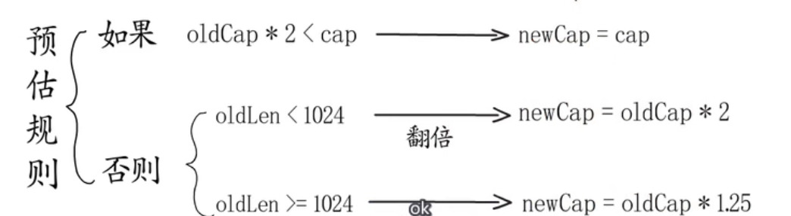
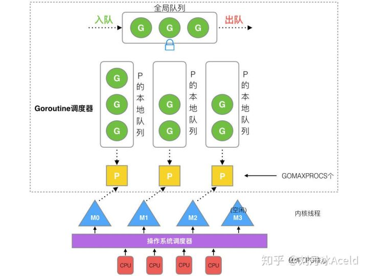

## 一、Golang

### 1.for range

切片实际上是一个结构体的语法糖，这个结构体有着一个指向数组的指针成员。在循环开始前对这个结构体==生成副本==然后赋值给 `for_temp`，后面的循环实际上是在对 `for_temp` 进行迭代。任何对于原始变量 `v` 本身（而非对其背后指向的数组）的更改都和生成的副本 `for_temp` 没有关系。但其背后指向的数组还是以指针的形式共享给 `v` 和 `for_temp`，所以 `v[i] = 1` 这样的语句仍然可以工作。

切片实际上是一个结构体，其中有一个底层数组的指针。for range时，会先copy一份结构体，再对其进行迭代，这样在循环中对原始变量的改变跟这份副本无关，但是两个结构体仍共享一个底层数组。

```go
type slice struct {
    array unsafe.Pointer	// 8 bytes
    len   int				// 8 bytes
    cap   int				// 8 bytes
}
```

### 2.不可比较的类型

* map
* slice
* 数组长度不同，不能比较
* struct   成员有不可比较类型时，不能比较
* func
* 引用类型比较的是是否指向了同一个变量
* 自定义类型不可比较（type A string）,别名可比较（type A = string）

**使用工具包[]byte可以对切片进行比较**

**使用反射（reflect.DeepEqual()）可以对任意类型进行比较**

**使用cmp.Diff()**

### 3.slice的值传递

go只有值传递，slice是一个结构体，这个结构体中有一个指针，指向申请出来的实际内存，也就是保存元素的内存。

传递slice的时候，这个结构体是值传递的，传递完成后，内存中有两个“slice结构体”，它们引用同一块“slice数组”

append这个函数则根据情况不同有两种工作方式，若你slice的cap足够，则直接修改其引用的数组区域并简单将len增加，并返回这个slice本身，即这时候h=append(h,...)之后，h还是引用原来的数组区域，只不过h的len增加了；==若cap不够==，则重新申请一块数组区域并将原来的数组内容拷贝过去后再进行追加元素操作，==这时候append的返回的slice引用的是另一块内存了==

### 4.channel

#### CSP模型

CSP 是 Communicating Sequential Process 的简称，中文可以叫做通信顺序进程，是一种并发编程模型。

==CSP 模型由并发执行的实体（线程或者进程）所组成，实体之间通过发送消息进行通信，这里发送消息时使用的就是通道==，或者叫 channel。

==channel是通过注册相关goroutine id实现消息通知的。==

channel通过共享内存通信。

#### channel构成

**hchan**

* 环形队列（循环链表实现）
* 状态、长度等信息
* 元素类型
* 锁
* 等待读写的goroutine（*waitq）

**waitq**

* 头尾指针

#### 缓冲

* 无缓冲：发送和接收动作是同时发生的。如果没有 goroutine 读取 channel （<- channel），则发送者 (channel <-) 会一直阻塞。
* 缓冲：缓冲 channel 类似一个有容量的队列。当队列满的时候发送者会阻塞；当队列空的时候接收者会阻塞。

**不要从接收者一侧关闭channel**

#### 关闭channel

A. 给一个 nil channel 发送数据，造成永远阻塞
B. 从一个 nil channel 接收数据，造成永远阻塞
C. 给一个已经关闭的 channel 发送数据，引起 panic
D. 从一个已经关闭的 channel 接收数据，如果缓冲区中为空，则返回一个零值
E. 无缓冲的channel是同步的，而有缓冲的channel是非同步的

#### select

select 一定程度上可以类比于 linux 中的 IO 多路复用中的 select。后者相当于提供了对多个 IO 事件的统一管理，而 Golang 中的 select 相当于提供了对多个 channel 的统一管理。

#### 利用select实现超时控制

```
select {
  case <- ch:
    // get data from ch
  case <- time.After(2 * time.Second)
    // read data from ch timeout
}

```

### 5.golang sync

> cpu能在一个指令中完成的操作就可以称为原子操作。例如64位的操作系统，一次可以处理8byte的内容，如果一次赋值的内容小于等于8byte，那么可以认为这是一个**single machine word，**是由系统底层保证操作的原子性。
>
> cpu的设计者为了更加充分的利用cpu的性能，例如分支预测，流水线等，指令重排会将读写指令进行重排，但是会保证最后结果的正确，但是在多线程的环境下就会出问题，造成数据不正确。

#### 1.锁

sync 包中定义了 Locker 结构来代表锁。

```golang
type Locker interface {
    Lock()
    Unlock()
}
```

并且创造了两个结构来实现 Locker 接口：Mutex 和 RWMutex。

**mutex（互斥锁），RWMUtex（读写锁）**

##### mutex

* 互斥锁的状态

    锁定、饥饿、唤醒
    
* `sync.Mutex`有两种模式——正常模式和饥饿模式。

    在正常模式下，锁的等待者会按照==先进先出的顺序获取锁==。但是刚被唤起的 Goroutine 与新创建的 Goroutine 竞争时，大概率会获取不到锁，为了减少这种情况的出现，一旦 Goroutine 超过==1 ms== 没有获取到锁，它就会将当前互斥锁切换为==饥饿模式==

    ==饥饿模式中，互斥锁会直接交给等待队列最前面的 Goroutine。==

    如果一个 Goroutine==获取到了互斥锁==并且它==在队列末尾的时间或者它等待的时间少于 1ms==，那么当前的互斥锁就会切换回正常模式。

* 上锁

    上锁sync.Mutex.Lock，解锁sync.Mutex.Unlock。

    1. 判断当前 Goroutine 能否进入自旋

        互斥锁只有在普通模式才能进入自旋

        `runtime.sync_runtime_canSpin`需要返回`true`：

        * 运行在多核处理器上

        * 当前 Goroutine 为了获取该锁进入自旋的次数小于四次

        * 当前机器上至少存在一个正在运行的处理器P 并且其运行队列为空

    2. 通过自旋等待 占用CPU

    3. 计算互斥锁的最新状态

    4. 更新(使用CAS)互斥锁的状态并获取锁

* 解锁

    该过程会先使用`sync/atomic.AddInt32`函数快速解锁，这时会发生下面的两种情况：

    1. 如果该函数返回的新状态等于 0，当前Goroutine就成功解锁了互斥锁

    2. 如果该函数返回的新状态不等于 0，这段代码会调用`sync.Mutex.unlockSlow`开始慢速解锁

        `sync.Mutex.unlockSlow`会==先校验锁状态的合法性==——如果当前互斥锁已经被解锁过了会直接抛出导常”sync: unlock of unlocked mutex“终止程序。

        在正常模式下，上述代码会使用如下所示的处理过程：

        * 如果互斥锁不存在等待者或互斥锁的`mutexLocked`、`mutexStarving`、`mutexWoken`状态都不为 0，那么当前方法可以直接返回，不需要唤醒其他等待者
        * 如果互斥锁存在等待者，会通过`runtime.sync_runtime_Semrelease`唤醒等待者并移交锁的所有权

        在==饥饿模式下==，上述代码会直接调用`runtime.sync_runtime_Semrelease`==将当前锁交给下一个正在尝试获取锁的等待者==，等待者被唤醒后会得到锁，在这时互斥锁还不会退出饥饿状态
    
* 锁复制问题、锁重入问题

    函数的代码调用，当做参数传过去，重新进行加锁，解锁就会造成意想不到的结果，因为锁是有状态的，复制锁的时候会将锁的状态一起复制过去。对于这种复制锁造成的问题，可以使用**go vet** 来检查代码中的锁复制问题

    **锁的重入**，也就是同一个goroutine多次去获取锁，当然在go的标准库下是没有重入锁的实现。可以自己实现可重入锁，实现Locker接口，记录锁的次数。

#### 2.临时对象池

每个 goroutine 不再自己单独创建对象，而是从对象池中获取出一个对象（如果池中已经有的话）。

sync.Pool 提供两个方法 :Get 和 Put 和一个初始化回调函数 New。

在系统自动 GC 的时候，触发 pool.go 中的 poolCleanup 函数。这个函数会把 Pool 中所有 goroutine 创建的对象都进行销毁。

sync.Pool 其实==不适合用来做持久保存的对象池（比如连接池）。它更适合用来做临时对象池，目的是为了降低 GC 的压力==。

#### 3.Once

多个 goroutine 都要过一个操作，但是这个操作我只希望被执行一次，这个时候 Once 就上场了。

```go
    for i := 0; i < 10; i++ {
        go func() {
            once.Do(onceBody)
        }()
    }
```

#### 4.WaitGroup和Cond

一个 goroutine 需要等待一批 goroutine 执行完毕以后才继续执行，那么这种多线程等待的问题就可以使用 WaitGroup。（main函数中为了等待其他线程执行完）

sync.Cond 是用来控制某个条件下，goroutine 进入等待时期，等待信号到来，然后重新启动。sync.Cond 还有一个 BroadCast 方法，用来通知唤醒所有等待的 gouroutine。

在`WaitGroup` 对象实现中，内部有一个计数器，最初从0开始，它有三个方法：

* `Add()`：计数器加一
* `Done()`：计数器减一
* `Wait()`：等待计数器清零

==执行`Wait`方法的函数在等待组内部计数器不为0的时候回阻塞==，一旦计数器为0了，程序就会继续往下执行。

### 6.golang map底层实现

#### map的实现

Golang中`map`的底层实现是一个散列表，因此实现`map`的过程实际上就是实现散表的过程。在这个散列表中，主要出现的结构体有两个，一个叫`hmap`，一个叫`bmap`

* hmap：


* bucket

    

由此看出`hmap`和`bucket`的关系是这样的：

Golang的哈希函数会把传过来的key进行哈希运算，求得的值一分为二：高位和低位。

然后==低位用于寻找当前key属于hmap中的哪个bucket，而高位用于寻找bucket中的哪个key==。


m为桶的个数，要保证不会出现空桶，就要保证m为2的整数次幂。

这样m的二进制表示一定只有一位为1，m-1则是低于这一位的均为1。

#### map的扩容

当以上的哈希表增长的时候，Go语言会将bucket数组的数量扩充一倍，产生一个新的bucket数组，并将旧数组的数据迁移至新数组。

判断扩充的条件：

1.==负载因子==(即loadFactor)， 公式 count/ 2^B>6.5 （2^B为桶的个数）                         ----------> 翻倍扩容

2.如果负载因子没有超标，使用的溢出桶较多(B<=15, 溢出桶的数目超过常规桶或者B>15, 溢出桶数目大于2^15)      ---->等量扩容

==即当有大量键值对被删除时，会出现2的情况，这便是等量扩容的意义。==

#### sync.Map

sync.Map 的实现原理可概括为：

* 通过 read 和 dirty 两个字段将==读写分离==，读的数据存在只读字段 read 上，将最新写入的数据则存在 dirty 字段上
* ==读取时会先查询 read，不存在再查询 dirty，写入时则只写入 dirty==
* 读取 ==read 不需要加锁==，而==读或写 dirty 都需要加锁==
* 另外有 misses 字段来统计 read 被穿透的次数（被穿透指需要读 dirty 的情况），超过一定次数则将 dirty 数据同步到 read 上
* 对于删除数据则直接==通过标记来延迟删除==

### 7.golang slice

slice构成 ：  底层数组array  长度len  容量cap

append会为元素开辟底层数组

slice可以共用底层数组，但如果元素发生改变，原先的数组不能用了，就要把元素重新拷贝到新的空间。

#### slice扩容规则

##### 预估容量

1.如果容量翻倍还是小于所需容量，预估容量等于所需最小容量

2.否则，如果之前元素个数小于1024，预估容量为原先的2倍。如果之前元素个数大于等于1024，预估容量等于原先容量的1.25倍。



##### 分配内存

语言管理模块会向操作系统申请一批常用的内存，分成多个模块管理起来。

根据预估容量申请最为匹配的内存。

### 8.golang 垃圾回收

#### 1.标记清除算法

扫描数据段和栈，把能够==直接追踪到的数据作为root==，基于root进一步追踪，把能够追踪到的数据进行标记，剩下的即为垃圾，将其清除掉。

**缺点** 容易产生==内存碎片==

#### 2.标记整理算法

标记阶段与标记清除算法相同。完成标记工作后，会对堆内存进行压缩，将==非垃圾数据移动到一块紧凑的内存中==，其他的垃圾清理掉。

**缺点** 需要移动数据，耗时

#### 3.复制回收算法

把堆内存分成两个相等的空间 From 和 To

1. 程序执行时使用From空间

2. 垃圾回收执行时会扫描From空间，把能追踪到的数据复制到To空间。
3. 当所有数据复制到To空间后，==From和To角色互换==，原来的From被回收变为新的To

**缺点** ==只有一半的空间可用==

#### 4.分代回收算法

基于==弱分代假说：大部分对象都在年轻时死亡==。

把数据分为新生代和老年代。分别采用不同的策略。经历一定次数垃圾回收依然存活的对象晋升为老年代对象。

**缺点** 算法复杂

强分代假说：熬过越多次数垃圾回收过程的对象就越难消亡。

#### 5.引用计数算法

记录一个对象被引用的次数，当引用计数更新到0时，表示这个对象不再有用

**缺点** ==无法解决循环引用问题==

#### 6.三色抽象

* 开始把所有对象都标记为==白色==
* 把能==直接追踪到的root节点标记为灰色==（灰色代表基于该节点展开的标记还未完成）
* 当某个节点的追踪任务完成后，将其标记为==黑色==
* 当没有灰色节点时，代表标记完成。有用数据为黑色，无用数据为白色。

root一般是==全局变量==（长期存活的对象）和 ==栈中对象==、==处于激活状态的协程==（至少是当前存活的对象）等

###### 弱三色不变式：保证黑色对象引用的白色对象在灰色对象的可达范围内

###### 强三色不变式：不允许存在黑色对象到白色对象的引用

#### 7.增量式垃圾回收

为了尽量缩短STW的时间，增量式垃圾回收用户程序与垃圾回收器交替执行，将垃圾回收工作分为多次完成进而缩短暂停时间。

问题：交替执行，垃圾回收程序可能把有用数据误判为垃圾

解决：

* 写屏障

    写屏障会在操作时插入指令，把数据对象的修改通知到垃圾回收器，所以写屏障都会有一个记录集。

* 读屏障

    在标记整理或复制型回收器中，由于会移动数据，读操作也并非安全。

    需要建立读屏障确保用户程序不会访问已经存在副本的陈旧数据。

    * 检测对象已经存在副本，就读取T0空间的副本
    * 将新加载的引用的目标对象复制到T0空间

#### 8.Golang垃圾回收

Golang垃圾回收三种模式

* GcBackgroundMode  标记和清扫都是并发的
* GcForceMode              只在清扫阶段并发
* GcForceBlockMode    全程STW

两个全局变量

* gcControllerState结构体：用于支持标记工作顺利执行
* work结构体：用于存储全局工作信息

**阶段：**

（1）==mark setup==

​		==完成上一轮GC未完成的清扫任务==。

​		为每个P创建mark work协程，创建后进入休眠，在标记阶段开启调度

（2）==第一次STW==

​		开启写屏障，在work中==记录bss段，data段，栈等root节点的工作信息==。

> 一个程序本质上都是由 bss段、data段、text段三个段组成
>
> **text段**: 用于存放程序代码的区域， 编译时确定， 只读。
>
> **data段** :通常是指用来存放程序中已初始化的全局变量的一块内存区域。数据段属于静态内存分配。
>
> **bss段**：通常是指用来存放程序中未初始化的或者初始化为0的全局变量和静态变量的一块内存区域。特点是可读写的，在程序执行之前BSS段会自动清0。

（3）==start the world 并发标记==

​		用户程序与垃圾回收程序共同工作。此时的用户程序称为赋值器。写入指针时触发写屏障，新分配的对象直接标记为黑色。

（4）==第二次STW==

​		==确认==标记工作已经完成

​		==关闭写屏障==

（5）==start the world==

​		进入==清扫==阶段

### 9.GPM调度

#### 1.被废弃的goroutine调度器


M想要执行、放回G都必须访问全局G队列，并且M有多个，即多线程访问同一资源需要加锁进行保证互斥/同步，所以全局G队列是有互斥锁进行保护的。

老调度器有几个缺点：

1. 创建、销毁、调度G都需要每个M获取锁，这就形成了==激烈的锁竞争==。
2. M转移G会造成==延迟和额外的系统负载==。
3. 系统调用(CPU在M之间的切换)导致频繁的==线程阻塞和取消阻塞操作==增加了系统开销。

#### 2.GPM调度



1. **全局队列**（Global Queue）：存放等待运行的G。
2. **P的本地队列**：同全局队列类似，==存放的也是等待运行的G==，存的数量有限，不超过256个。==新建G'时，G'优先加入到P的本地队列，如果队列满了，则会把本地队列中一半的G移动到全局队列。==
3. **P列表**：所有的P都在==程序启动时创建==，并保存在数组中，最多有`GOMAXPROCS`(可配置)个。
4. **M**：==线程想运行任务就得获取P，从P的本地队列获取G，P队列为空时，M也会尝试从全局队列拿一批G放到P的本地队列，或从其他P的本地队列**偷**一半放到自己P的本地队列。M运行G，G执行之后，M会从P获取下一个G，不断重复下去==。

> 每个G需要被绑定到P才能够被执行。
>
> 对于M来说，P提供了相应的执行环境
>
> M线程抽象，负责调度任务，和某个P绑定，从P的runq中不断取出G

##### work stealing机制

==当本线程无可运行的G时，尝试从其他线程绑定的P偷取G，而不是销毁线程。==

##### hand off机制 

==当本线程因为G进行系统调用阻塞时，线程释放绑定的P，把P转移给其他空闲的线程执行。==

##### go func() 调度流程

1、我们通过 go func()来==创建一个goroutine==；

2、有两个存储G的队列，一个是局部调度器P的本地队列、一个是全局G队列。新创建的G会==先保存在P的本地队列中==，如果P的本地队列已经==满==了就会保存在==全局的队列==中；

3、==G只能运行在M中，一个M必须持有一个P==，M与P是1：1的关系。==M会从P的本地队列弹出一个可执行状态的G来执行，如果P的本地队列为空，就会想其他的MP组合偷取一个可执行的G来执行==；

4、一个M调度G执行的过程是一个循环机制；

5、当M执行某一个G时候如果发生了syscall或则其余阻塞操作，M会阻塞，如果当前有一些G在执行，runtime会把这个线程M从P中摘除(detach)，然后再创建一个新的操作系统的线程(如果有空闲的线程可用就复用空闲线程)来服务于这个P；

6、当M系统调用结束时候，这个G会尝试获取一个==空闲的P执行==，并放入到==这个P的本地队列==。如果获取不到P，那么这个线程M变成==休眠==状态， 加入到空闲线程中，然后这个G会被放入全局队列中。

##### 特殊的M0和G0

**M0**

M0是启动程序后的编号为0的主线程，这个M对应的实例会在全局变量runtime.m0中，不需要在heap上分配，M0负责执行初始化操作和启动第一个G， 在之后M0就和其他的M一样了。

**G0**

G0是每次启动一个M都会第一个创建的gourtine，G0仅用于负责调度的G，G0不指向任何可执行的函数, 每个M都会有一个自己的G0。在调度或系统调用时会使用G0的栈空间, 全局变量的G0是M0的G0。

### 10.golang调试工具

**Devle(dlv)**  调试工具

**pprof** 性能分析工具 调试CPU Heap gc

#### 命令 ：    ``` dlv debug main.go```

1、dlv debug main.go #debug一个main.go程序
2、break（b）main.main #在main包里的main函数入口打断点
3、continue（c） #继续运行，直到断点处停止
4、next（n） #单步运行
5、locals #打印local variables
6、print（p） #打印一个变量或者表达式
7、restart（r） #Restart Process

### 11.new和make的区别

new只分配内存，make用于slice，map，和channel的初始化。

new(T) 为一个 T 类型新值分配空间并将此空间初始化为 T 的零值，返回的是新值的地址。

make(T, args) 返回的是 T 的 引用。

### 12.两个协程交替输出

使用无缓冲的channel阻塞的特性控制顺序

```go
package main
import (
    "fmt"
    "time"
)
var POOL = 100
func groutine1(p chan int) {
    for i := 1; i <= POOL; i++ {
        p <- i
        if i%2 == 1 {
            fmt.Println("groutine-1:", i)
        }
    }
}
func groutine2(p chan int) {
    for i := 1; i <= POOL; i++ {
        <-p
        if i%2 == 0 {
            fmt.Println("groutine-2:", i)
        }
    }
}
func main() {
    msg := make(chan int)
    go groutine1(msg)
    go groutine2(msg)
    time.Sleep(time.Second * 1)
}
```

使用sync.waitGroup{}实现

```
func main()  {
	w1 := sync.WaitGroup{}
	w2 := sync.WaitGroup{}
	w2.Add(1)
	go func() {
		for i := 1; i < 100; i+=2 {
			w1.Wait()
			fmt.Println("g1", i)
			w1.Add(1)
			w2.Done()
		}
	}()
	for i := 2; i <= 100; i+=2 {
		w2.Wait()
		fmt.Println("g2", i)
		w2.Add(1)
		w1.Done()
	}
}
```


### 13.go命令

```go
go env: #用于查看go的环境变量
go run: #用于编译并运行go源码文件
go build: #用于编译源码文件、代码包、依赖包
go get: #用于动态获取远程代码包
go install: #用于编译go文件，并将编译结构安装到bin、pkg目录
go clean: #用于清理工作目录，删除编译和安装遗留的目标文件
go version: #用于查看go的版本信息
```

### 14.go异常

* 空指针解析
*  下标越界
*  除数为0
*  调用panic函数

### 15.网络通信超时设置

#### 1.SetDeadline

Go实现超时的网络原语(primitive): **Deadline** (最后期限)。

Deadline是一个绝对时间值，当到达这个时间的时候，所有的 I/O 操作都会失败，返回超时(timeout)错误。一旦设置它们永久生效。

所有的超时的实现都是基于Deadline。

#### 2.服务器端超时设置

`http.Server`有两个设置超时的方法: ==ReadTimeout和 andWriteTimeout==。

```go
srv := &http.Server{  
    ReadTimeout: 5 * time.Second,
    WriteTimeout: 10 * time.Second,
}
log.Println(srv.ListenAndServe())
```

`ReadTimeout`的时间计算是从连接被接受(accept)到request body完全被读取。

`WriteTimeout`的时间计算正常是从request header的读取结束开始，到 response write结束为止。

>`net/http`包下的封装的绕过`http.Server`的函数`http.ListenAndServe`, `http.ListenAndServeTLS` 和 `http.Serve`并不适合实现互联网的服务器。这些函数让超时设置默认不启用，并且你没有办法设置启用超时处理

#### 3.客户端超时设置

最简单的方式就是使用`http.Client`的 `Timeout`字段。 它的时间计算包括从连接(Dial)到读完response body。

```go
c := &http.Client{  
    Timeout: 15 * time.Second,
}
resp, err := c.Get("https://blog.filippo.io/")
```

### 16.反射

* 在运行时检查type

    ```go
    varType := reflect.TypeOf(var)
    ```

* 在运行时检查/修改/创建 值/函数/结构

### 17.指针

* *类型:普通指针类型，用于传递对象地址，不能进行指针运算。
* unsafe.Pointer:通用指针类型，用于转换不同类型的指针，不能进行指针运算，不能读取内存存储的值（必须转换到某一类型的普通指针）。
* uintptr:用于指针运算，整型，很容易计算出下一个指针位置，GC 不把 uintptr 当指针，uintptr 无法持有对象。uintptr 类型的目标会被回收。

**unsafe.Pointer 是桥梁，可以让任意类型的指针实现相互转换，也可以将任意类型的指针转换为 uintptr 进行指针运算。**

### 18.Golang内存分配机制

Go的内存分配器采用了跟==tcmalloc库==（原理：把内存划分多级管理，降低锁的粒度）相同的实现。

Go 在程序启动的时候，会==先向操作系统申请一块内存，切成小块后自己进行管理==。


* **arena**: go从堆中分配的内存，都放到这里，单位是一页8K。多个页连成一个span。
* **bitmap**: 表示arena区哪些地址保存了对象，哪些地址保存了指针。垃圾回收使用。
* **spans**: 存的是span指针（mspan），用于表示arena区域中的下标对应的页属于哪个span

#### mspan

包含多个类型相同的span的一个双向链表

**内存管理单元**

#### 内存池 mheap

`mheap`：代表Go程序持有的所有堆空间，Go程序使用一个`mheap`的全局对象`_mheap`来管理堆内存。

它是一个池子，当上层释放内存时它不实际归还给操作系统，而是放回池子重复利用。

#### mcentral

`mcentral`：为所有`mcache`提供切分好的`mspan`资源。每个`central`保存一种特定大小的全局`mspan`列表，包括已分配出去的和未分配出去的。 每个`mcentral`对应一种`mspan`，而`mspan`的种类导致它分割的`object`大小不同。当工作线程的`mcache`中没有合适（也就是特定大小的）的`mspan`时就会从`mcentral`获取。

#### mcache

每个工作线程都会绑定一个`mcache`,本地缓存可用的mspan资源，这样可以直接给goroutine分配，不存在多个goroutine竞争的情况以消耗锁资源。

#### 分配流程

* 大于==32K== 的大对象直接从 ==mheap==分配。

* 小于 ==16B== 的使用 ==mcache== 的微型分配器分配

* 对象大小在 16B ~ 32K 之间的的，首先通过计算使用的大小规格，然后使用 ==mcache== 中对应大小规格的块分配

* 如果对应的大小规格在==mcache== 中==没有可用的块==，则向 ==mcentral 申请==

* 如果 ==mcentral 中没有可用的块==，则向 ==mheap 申请==，并根据 BestFit 算法找到最合适的 mspan。如果申请到的 mspan 超出申请大小，将会根据需求进行切分，以返回用户所需的页数。剩余的页构成一个新的 mspan 放回 mheap 的空闲列表。

* 如果 mheap 中没有可用 span，则向==操作系统申请==一系列新的页

#### 其他优化

* zero size

    有一些对象所需的内存大小是0，比如 `[0]int`, `struct{}`，这种类型的数据直接返回固定的空间。

* Tiny对象

    将 `< 16B` 的对象为统一视为 tiny 对象(tinysize)。分配时，从 `sizeclass=2` 的 span 中获取一个 `16B` 的 object 用以分配。

### 19.context

* 每一个**长请求**都应该有个**超时限制**
* 需要在调用中传递这个超时

**什么时候使用context**

* 每一个 RPC 调用都应该有**超时退出**的能力，这是比较合理的 API 设计
* **不仅仅** 是超时，你还需要有能力去结束那些不再需要操作的行为
* context.Context 是 Go 标准的解决方案
* 任何函数可能被阻塞，或者需要很长时间来完成的，都应该有个 context.Context

Context接口包含四个方法：

* ==Deadline==返回绑定当前context的任务被取消的截止时间；如果没有设定期限，将返回ok == false。
* ==Done==当绑定当前context的任务被取消时，将返回一个关闭的channel；如果当前context不会被取消，将返回nil。
* ==Err== 如果Done返回的channel没有关闭，将返回nil;如果Done返回的channel已经关闭，将返回非空的值表示任务结束的原因。如果是context被取消，Err将返回Canceled；如果是context超时，Err将返回DeadlineExceeded。
* ==Value==返回context存储的键值对中当前key对应的值，如果没有对应的key,则返回nil。

### 20.gin中间件原理

中间件(middleware)，其原理就是对一个**方法**进行包裹装饰，然后返回**同类型**的方法

中间件是一个==洋葱模型==，中心为最终处理请求的 handler，称为 main handler，其他为 middleware handler 。每一个 middleware handle 可以分为两部分，随着 request 的流动，左边是入，右边为出，而分割点就是 next 。

next 的作用就是明确在这个地方进入到下一个 handler 。

装饰者模式，对一个方法进行包裹装饰，返回同类型的方法。


gin默认提供两个中间件，Logger和Recovery，用于打印日志和panic处理。

web开发中，常见情景，执行请求handler函数前，对token进行合法性校验。

### 21.golang sort包

* sort包

    sort包中实现了３种基本的排序算法：插入排序．快排和堆排序．和其他语言中一样，这三种方式都是不公开的，他们只在sort包内部使用。

    sort.Interface定义的三个方法：获取数据集合长度的Len()方法、比较两个元素大小的Less()方法和交换两个元素位置的Swap()方法，就可以顺利对数据集合进行排序。sort包会根据实际数据自动选择高效的排序算法。

    任何实现了 sort.Interface 的类型（一般为集合），均可使用该包中的方法进行排序。这些方法要求集合内列出元素的索引为整数。

* 使用sort包实现堆排序

    实现sort.interface{}接口

    其中的五个方法，Len()  Less()  Swap()  ==引用==

    Push() Pop()  ==指针==

    ```go
    type IHeap []int
    
    func (h IHeap) Len() int           { return len(h) }
    func (h IHeap) Less(i, j int) bool { return h[i] < h[j] }
    func (h IHeap) Swap(i, j int)      { h[i], h[j] = h[j], h[i] }
    
    func (h *IHeap) Push(x interface{}) {
        *h = append(*h, x.(int))
    }
    
    func (h *IHeap) Pop() interface{} {
        old := *h
        n := len(old)
        x := old[n-1]
        *h = old[0 : n-1]
        return x
    }
    ```

### 22.定时器

* time

    `time.After(d Duration)` 好像不如直接用 `time.Sleep(d Duration)`舒服，但存在即合理，`time.After(d Duration)`的强大之处在于是基于`channel`的，可以在不同的协程间同步传递。

    `time.Ticker` 的使用分两种场景：执行几次后退出 和 循环执行不退出，执行几次就退出的话我们需要需要回收 `time.Ticker`。

    ```go
    func main() {
        // 创建一个计时器
        timeTicker := time.NewTicker(time.Second * 2)
        i := 0
        for {
            if i > 5 {
                break
            }
    
            fmt.Println(time.Now().Format("2006-01-02 15:04:05"))
            i++
            <-timeTicker.C
    
        }
        // 清理计时器
        timeTicker.Stop()
    }
    ```

* crontab

### 23.byte rune

`byte`是`uint8`的别名类型，而`rune`则是`int32`的别名类型

### 24.gengine

​      a.**基于Antlr4来自定义规则的语法，最终生成语法树结构**

​				使用语法解析工具来实现自定义语言

​      b.**基于golang的反射技术来实现对用户自定义API的调用**

​      c.**基于golang的并发编程技术来实现高性能的规则执行能力**

在计算机科学中，抽象语法树（Abstract Syntax Tree，AST），是源代码语法结构的一种抽象表示。它以树状的形式表现编程语言的语法结构，树上的每个节点都表示源代码中的一种结构。

### 25.httprouter

httprouter基于radix tree这种数据结构

入口：httprouter.New()，它返回一个router实例

注册handler httprouter.Router类型类似于http包中的ServeMux，它实现了http.Handler接口，所以它是一个http.Handler。它可以将请求分配给注册好的handler。

httprouter.Handle()用于为路径注册指定的Handle，而httprouter.Handle对应于http.HandlerFunc，所以是直接将Handle类型的函数绑定到指定路径上。同时，它还可以指定http方法：GET, POST, HEAD, PUT, PATCH, DELETE, OPTIONS。

**为什么不用哈希**

因为URL中存在不确定的字符串，不是一个确定的URL

### 26.init()函数

**每个包中可以有多个`init`函数，而其他包的`init`是在main包的`init`调用之前被执行，`main`函数最后执行即可**

* 在同一个文件中的多个init方法，按照在代码中==编写的顺序==依次执行不同的init方法

* 在同一个package中，不同文件中的init方法的执行==按照文件名先后==执行各个文件中的init方法

关于下划线：引入包，会先调用包中的初始化函数，这种使用方式仅让导入的包做初始化，而不使用包中其他功能。

### 27.main函数

1.Go中main函数不支持任何返回值
2.可以通过os.Exit(0)来返回状态

3.main函数不支持传入参数
4.在程序中可通过os.Args或者flag包来获取命令行参数

### 28.热更新配置

* 开启事件监听，确认用户更新文件后是否可以正常读取（或者监听到文件更改后）
* 将内容注入到程序对象

### 29.反射

Golang提供了一种机制，在编译时**不知道类型的情况下**，可**更新变量**、运行时**查看值**、**调用方法**以及直接对他们的**布局进行操作**的机制，称为反射。

reflect提供了两种类型来进行访问接口变量的内容：

| 类型              | 作用                                                         |
| ----------------- | ------------------------------------------------------------ |
| reflect.ValueOf() | 获取输入参数接口中的数据的值，如果为空则返回**0** <- 注意是0 |
| reflect.TypeOf()  | 动态获取输入参数接口中的值的类型，如果为空则返回**nil** <- 注意是nil |

原理：数据interface中保存有结构数据呀，只要想办法拿到该数据对应的内存地址，然后把该数据转成interface，通过查看interface中的类型结构，就可以知道该数据的结构了。

### 30.内存泄露

* 为什么会有内存泄漏

    用对象（不再使用的对象）持续占有内存或无用对象的内存得不到及时释放，从而造成内存空间的浪费称为内存泄漏。

* 内存泄漏编译期间能发现吗

    可以发现一部分，但大多数内存泄漏是动态行为，运行时才能发现。

* 具有自动垃圾回收的语言为什么还会有内存泄漏

    案例：

    ```go
    func main() {
    	var str0 = "12345678901234567890"
    	str1 := str0[:10]
    }
    ```

    以上代码，会有10字节的内存泄漏，我们知道，str0和str1底层共享内存，只要str1一直活跃，str0 就不会被回收，10字节的内存被使用，剩下的10字节内存就造成了临时性的内存泄漏，直到str1不再活跃

    有些编码不当的情况下，goroutine被长期挂住，导致该协程中的内存也无法被释放，就会造成永久性的内存泄漏。==例如协程结束时协程中的channel没有关闭，导致一直阻塞；例如协程中有死循环==。

    time.After底层实现是一个timer，而定时器未到触发时间，该定时器不会被gc回收，从而导致临时性的内存泄漏，而如果定时器一直在创建，那么就造成了永久性的内存泄漏了。

* 怎样解决内存泄漏问题

    使用pprof工具

    * ==CPU 分析==（profile）: 你可以在 url 上用 `seconds` 参数指定抽样持续时间（默认 30s），你获取到概览文件后可以用 `go tool pprof` 命令调查这个概览
    * ==内存分配==（allocs）: 所有内存分配的抽样
    * 阻塞（block）: 堆栈跟踪导致阻塞的同步原语
    * ==命令行调用（==cmdline）: 命令行调用的程序
    * ==goroutine: 当前 goroutine 的堆栈信息==
    * ==堆（heap）==: 当前活动对象内存分配的抽样，完全也可以指定 `gc` 参数在对堆取样前执行 GC
    * ==互斥锁（mutex）==: 堆栈跟踪竞争状态互斥锁的持有者
    * 系统线程的创建（threadcreate）: 堆栈跟踪系统新线程的创建
    * ==trace==: 追踪当前程序的执行状况. 你可以用 `seconds` 参数指定抽样持续时间. 你获取到 trace 概览后可以用 `go tool pprof` 命令调查这个 trace

* dump：在计算机领域，dump一般译作**转储**。

    因为程序在计算机中运行时，在内存、CPU、I/O等设备上的数据都是动态的（或者说是易失的），也就是说数据使用完或者发生异常就会丢掉。如果我想得到某些时刻的数据（有可能是调试程序Bug或者收集某些信息），就要把他转储（dump）为静态（如文件）的形式。否则，这些数据你永远都拿不到。

## 二、Java

### 1.基本数据结构

Java**中**有 8 种基本数据类型，分别为：

* **6 种数字类型 （四个整数形，两个浮点型）**：byte、short、int、long、float、double
* **1 种字符类型**：char
* **1 种布尔型**：boolean。

### 2.访问限定符

**Public**：公共，能被==项目==中的任何一个Class、Method、Field访问。

**Protected**：受保护，能被==同类或子类访问==，不能从外部访问。

**Default**：默认，只能被同一个包的Class、Method、Field访问。

**Private**：私有，只能被==本类==访问。

---

**final**：final修饰的类叫做最终类，该类不能被继承，final修饰的方法不能被重写，final修饰的变量叫常量，必须初始化，初始化后不能修改。

**abstract**：abstract修饰类，会使得类变成抽象类，抽象类不能生成实例，但是可以作为对象变量声明的类型，也就是编译时类型。抽象类相当于类的半成品，需要子类继承并覆盖其中的方法。

抽象类和接口(interface)有很大的不同之处，接口中不能有实例方法去实现业务逻辑，而抽象类可以有实例方法，并实现业务逻辑。

抽象类不能被final修饰，因为被final修饰的类无法被继承，而对于抽象类来说就是需要通过继承去实现抽象方法。

### 3.== 与equals

* ==

    * 基本类型：比较的是值是否相同；
    * 引用类型：比较的是引用是否相同；

* equals

    equals 本质上就是 ==，只不过 String 和 Integer 等重写了 equals 方法，把它变成了值比较。

### 4.创建对象的方式

* 使用new关键字，需要使用构造器
* 使用反射机制   Class类或Constructor类的newInstance()方法，需要使用构造器
* Object类的clone()方法，需要实现Cloneable接口，重写object类的clone方法，不会调用构造器
* 使用发序列化，需要让我们的类实现Serializable接口，在反序列化时，JVM创建对象并不会调用任何构造函数。

### 5.多线程的实现方式

* 继承Thread类，重写run方法。run 方法的方法体就代表了线程要完成的任务。因此把 run()方法称为执行体。
* 实现Runnable接口，重写run方法。该run()方法的方法体同样是该线程的线程执行体。
* 实现Callable接口，重写call方法。使用Callable相对于Runnable最大的不同点在于使用Callable创建的线程有返回值，而且允许抛出异常。
* 使用线程池。重复利用线程池中的线程，降低资源消耗。

### 6.线程池核心参数

* corePoolSize：核心线程数，也是线程池中常驻的线程数。
* maximumPoolSize：最大线程数，在核心线程数的基础上可能会额外增加一些非核心线程，需要注意的是只有当workQueue队列填满时才会创建多于corePoolSize的线程(线程池总线程数不超过maxPoolSize)
* keepAliveTime：非核心线程的空闲时间超过keepAliveTime就会被自动终止回收掉。
* unit：keepAliveTime的时间单位
* workQueue：用于保存任务的队列，可以为无界、有界、同步移交三种队列类型之一，当池子里的工作线程数大于corePoolSize时，这时新进来的任务会被放到队列中。
* threadFactory：创建线程的工厂类，默认使用Executors.defaultThreadFactory()，也可以使用guava库的ThreadFactoryBuilder来创建
* handler：线程池无法继续接收任务(队列已满且线程数达到maximunPoolSize)时的饱和策略，取值有AbortPolicy、CallerRunsPolicy、DiscardOldestPolicy、DiscardPolicy。

### 7.JVM


#### 程序计数器

内存空间小，线程私有。计数器记录的是正在执行的虚拟机字节码指令的地址；如果正在执行的是 Native 方法，这个计数器的值则为Undefined。

#### 虚拟机栈

线程私有，生命周期和线程一致。描述的是 Java 方法执行的内存模型：每个方法在执行时都会床创建一个栈帧(Stack Frame)用于存储局部变量表、操作数栈、动态链接、方法出口等信息。每一个方法从调用直至执行结束，就对应着一个栈帧从虚拟机栈中入栈到出栈的过程。

#### 堆

线程共享，主要是存放对象实例和数组。可以位于物理上不连续的空间，但是逻辑上要连续。

#### 本地方法栈

为虚拟机使用到的 Native 方法服务。

#### 方法区

属于共享内存区域，存储已被虚拟机加载的==类信息、常量、静态变量、即时编译器编译后的代码==等数据。

### 8.垃圾回收

* 判断哪些对象应该被回收

    （1）引用计数法

    （2）可达性分析算法
    通过一系列的称为 "GC Roots" 的对象作为起始点，从这些节点开始向下搜索，搜索所走过的路径称为引用链（Reference Chain），当一个对象到 GC Roots 没有任何引用链相连时，则证明此对象是不可用的。此算法解决了上述循环引用的问题。

    可以作为GC root的节点

    a. 虚拟机栈（栈帧中的本地变量表）中引用的对象。
    b. 方法区中类静态属性引用的对象。
    c. 方法区中常量引用的对象。
    d. 本地方法栈中 JNI（Native方法）引用的对象

* 强、软、弱、虚引用

    a. 强引用就是指在==程序代码之中普遍存在的==，类似"Object obj=new Object()"这类的引用，垃圾收集器永远不会回收存活的强引用对象。

    b. 软引用：还==有用但并非必需==的对象。在系统 **将要发生内存溢出异常之前** ，将会把这些对象列进回收范围之中进行第二次回收。

    c. 弱引用也是用来描述==非必需==对象的，被弱引用关联的对象 **只能生存到下一次垃圾收集发生之前** 。当垃圾收集器工作时，无论内存是否足够，都会回收掉只被弱引用关联的对象。

    d. 虚引用是最弱的一种引用关系。 **无法通过虚引用来取得一个对象实例** 。为一个对象设置虚引用关联的唯一目的就是能在这个对象被收集器回收时收到一个系统通知。

* major gc与full gc

    * **新生代GC（Minor GC）：**指发生在新生代的垃圾收集动作，因为Java对象大多都具备朝生夕灭的特性，所以Minor GC非常频繁，一般回收速度也比较快。
    * **老年代GC（Major GC / Full GC）：**指发生在老年代的GC，出现了Major GC，经常会伴随至少一次的Minor GC（但非绝对的，在Parallel Scavenge收集器的收集策略里就有直接进行Major GC的策略选择过程）。Major GC的速度一般会比Minor GC慢10倍以上。

* CMS垃圾回收器 

    ##### 1） 初始标记（CMS initial mark）

    首先根据之前讲过的“可达性分析算法“来判断有哪些对象是被GC Roots给引用的，如果是的话就是存活对象，否则就是垃圾对象。然后将垃圾对象都标记出来，如下图：

    注意：初始标记的过程会让系统停止工作，进入“Stop The World”状态，不过这个过程很快，仅仅标记GCRoots直接引用的那些对象。(回顾下GC Roots对象有：类的静态变量，方法的局部变量，但是类的实例变量不是GCRoots)
    
    假设我现在系统中有这样一段代码：
    
    ```java
    public class Test{
        private static Company company = new Company();
    }
    public class Company{
        private Employee employee = new Employee();
    }
    123456
    ```
    
    那么在内存中对应的初始标记阶段只会标记出来GC Roots直接引用的对象，也就是Company()对象，而employee对象仅仅是类的实例变量，不会被进行标记。内存图如下：
    
    注意：Employee对象仅仅是类的实例变量引用的对象，不是GCRoot直接引用的对象，因此初始标记并不会进行标记。
    
    ##### 2）并发标记（CMS concurrent mark）
    
    并发标记阶段恢复系统正常运行，可以随意创建对象，同时并发标记线程也开始工作，这里由于一边进行并发标记，一边进行对象的创建，必然会持续增加新的对象产生，同时也有可能一些对象失去引用变成垃圾对象。
    
    那么并发标记主要是标记哪些对象呢？比如上图中的Employee对象，垃圾回收线程会判断该对象被谁引用，这里是被company对象引用，再次判断company对象被谁引用，由于初始标记的时候已经知道是被GCRoots直接引用，从而判断到Employee对象是间接被GCRoots对象引用，从而标记为存活对象。
    
    
    
    总之，针对所有老年代中存在的对象以及不断新增的对象都会进行标记，而我们的系统线程也在一直工作不断产生对象，所以该阶段也是最耗时的。虽然是耗时的，但是垃圾回收与系统是并行进行的，所以并不会对系统的运行造成影响。
    
    ##### 3）重新标记（CMS remark）
    
    由于我们的第二个阶段是并发标记，那么肯定会造成有部分对象已经失去引用变成垃圾对象没有来得及更正，以及新创建的对象还未来得及标记，如下图：
    
    因此第三阶段：重新标记 会暂停我们的系统线程，开始重新整理，如下图：
    
    
    
    不过该阶段会很快，主要是针对第二阶段中被系统程序运行变动过的少数对象进行标记，所以速度很快。
    
    接着重新恢复系统线程工作，开始进入第四阶段：并发清理。
    
    ##### 4）并发清除（CMS concurrent sweep）
    
    最后是并发清除阶段， 清理删除掉标记阶段判断的已经死亡的对象， 由于不需要移动存活对象， 所以这个阶段也是可以与用户线程同时并发的。
    
    
    
    

## 三、进程间通信

### 1.概念

每个进程各自有不同的用户地址空间，所以进程之间要交换数据必须通过内核，在内核中开辟一块缓冲区，进程1把数据从用户空间拷到内核缓冲区，进程2再从内核缓冲区把数据读走，内核提供的这种机制称为**进程间通信**

由fork创建的新进程被称为子进程（child process）。

**该函数被调用一次，但返回两次。两次返回的区别是子进程的返回值是0**，而**父进程的返回值则是新进程（子进程）的==进程 id==。**

fork之后，**操作系统会复制一个与父进程完全相同的子进程，虽说是父子关系，但是在操作系统看来，他们更像兄弟关系，这2个进程==共享代码空间==，但是==数据空间是互相独立==的，子进程数据空间中的内容是父进程的完整拷贝，指令指针也完全相同，子进程拥有父进程当前运行到的位置**。

### 2.通信方式

* 匿名管道

    ==半双工，只能用于父子、兄弟进程间==，遵循先进先出

    管道的实质是一个内核缓冲区，管道一端的进程顺序地将进程数据写入缓冲区，另一端的进程则顺序地读取数据，该缓冲区可以看做一个循环队列，一个数据只能被读一次。

* 命名管道

    有一个路径名与其关联，存在于文件系统中，内容放在内存中，先进先出

    ==只要可以访问该路径，就能够彼此通过命名管道相互通信==

* 信号

    信号可以在任意时间发给某一进程，而不需要知道进程的状态。

    当某个信号被发送到一个正在运行的进程时，该进程即对信号注册相应的信号处理函数，以完成所需处理。

    有时候既不希望进程在接收到信号时立刻中断进程的执行，也不希望此信号完全被忽略掉，而是希望延迟一段时间再去调用信号处理函数，这个时候就需要信号==阻塞==来完成。

    1）硬件来源，例如按下了cltr+C，通常产生中断信号sigint

    2）软件来源，例如使用系统调用或者命令发出信号。最常用的发送信号的==系统函数==是kill,raise,setitimer,sigation,sigqueue函数。软件来源还包括一些非法运算等操作。

* 消息队列

    消息队列，就是一个==消息的链表==，是一系列保存在内核中消息的列表。用户进程可以向消息队列添加消息，也可以向消息队列读取消息。

    消息队列与管道通信相比，其优势是对==每个消息指定特定的消息类型==，接收的时候 不需要按照队列次序，而是可以==根据自定义条件接收特定类型的消息==。

* 共享内存

    ==使得多个进程可以直接读写同一块内存空间==，是最快的可用IPC形式。是针对其他通信机制运行效率较低而设计的。

    为了在多个进程间交换信息，内核专门留出了一块内存区，可以由需要访问的进程将其映射到自己的私有地址空间。进程就可以直接读写这一块内存而不需要进行数据的拷贝，从而大大提高效率。

    由于多个进程共享一段内存，因此需要==依靠某种同步机制（如信号量）来达到进程间的同步及互斥==。

* 信号量

    信号量是一个计数器，用于多进程对共享数据的访问，信号量的意图在于进程间同步。

* 套接字

    ==套接字时计算机之间进行通信的一种约定==。通过 socket 这种约定，一台计算机可以接收其他计算机的数据，也可以向其他计算机发送数据。

    套接字的特性由3个属性确定，它们分别是：域、端口号、协议类型。

### 3.PV操作

我们用==信号量及PV操作==来实现进程的同步和互斥。

PV操作由P操作原语和V操作原语组成（原语是不可中断的过程），对信号量进行操作，具体定义如下： P（S）： ①将信号量S的值减1，即S=S-1； ②如果S>0，则该进程继续执行；否则该进程置为等待状态，排入等待队列。

V（S）： ①将信号量S的值加1，即S=S+1；

### 4.线程与进程的区别

进程是运行中的程序，线程是==进程的内部==的一个==执行序列==

进程是==资源分配==的单元，线程是==CPU调度==的基本单位

进程间切换==代价大==，线程间切换==代价小==

多个线程共享进程的资源

进程间通信IPC，线程间可以直接读写进程数据段（如全局变量）来进行通信

### 5.线程私有内容与共享内容

* 私有内容
    1. 栈（局部变量，函数的参数）。
    2. 线程局部存储（Thread Local Storage，TLS），有限的容量。
    3. 寄存器 （执行流的基本数据）
* 公有内容
    1. 全局变量。
    2. 堆上的数据。
    3. 函数里的静态变量。
    4. 程序代码，任何线程都有权利读取并执行任何代码

## 四、Mysql数据库引擎

### 1.MyISAM与Innodb区别

* InnoDB 支持事务，MyISAM 不支持事务。

* InnoDB 支持外键，而 MyISAM 不支持外键。

* InnoDB 是聚集索引，MyISAM 是非聚集索引。

    > ==聚集索引的文件存放在主键索引的叶子节点上==，因此 InnoDB 必须要有主键，通过主键索引效率很高。但是==辅助索引需要两次查询==，先查询到主键，然后再通过主键查询到数据。因此，主键不应该过大，因为主键太大，其他索引也都会很大。
    >
    > 而 MyISAM 是非聚集索引，==数据文件是分离的==，索引保存的是数据文件的指针。==主键索引和辅助索引是独立的==。

* InnoDB 不保存表的具体行数，执行 select count(*) from table 时需要全表扫描。而MyISAM 用一个变量保存了整个表的行数，执行上述语句时只需要读出该变量即可，速度很快；

* InnoDB 最小的锁粒度是行锁，MyISAM 最小的锁粒度是表锁。

### 2.MyISAM与 Innodb怎么选择

**INNODB会支持一些关系数据库的高级功能，如事务功能和行级锁，MYISAM不支持。MYISAM的性能更优，占用的存储空间少。**

* 是否要支持事务，如果要请选择 InnoDB，如果不需要可以考虑 MyISAM；
* 如果表中绝大多数都只是读查询，可以考虑 MyISAM，如果既有读写也挺频繁，请使用InnoDB。
* 系统奔溃后，MyISAM恢复起来更困难，能否接受，不能接受就选 InnoDB；

### 3.MySql联合索引

#### 最左匹配

所谓最左匹配原则指的就是如果你的 SQL 语句中用到了联合索引中的最左边的索引，那么这条 SQL 语句就可以利用这个联合索引去进行匹配，值得注意的是，当遇到范围查询(>、<、between、like)就会停止匹配。

InnoDB会使用主键索引在B+树维护索引和数据文件，然后我们创建了一个联合索引（b，c，d）==也会生成一个索引树==，同样是B+树的结构，只不过==它的data部分存储的是联合索引所在行的主键值==（上图叶子节点紫色背景部分）。 联合索引是个**非聚簇索引** 

对于联合索引来说只不过比单值索引多了几列，而这些索引列全都出现在索引树上。==对于联合索引，存储引擎会首先根据第一个索引列排序；如果第一列相等则再根据第二列排序。==

### 4.索引应用场景

1. 建立索引的目的就是帮助查询,==如果查寻用不到则索引就没有必要建立==。
2. 如果表是==经常需要更新的也不适合做索引== 。频繁更新会导致索引也会频繁更新，降低写的效率。
3. ==唯一性差的字段不适合创建索引==。
4. 当给一个字段创建了索引的话，而这个字段要进行like模糊查询的话，那么这个值左边不可以有%，因为索引查询是要从左到右的，你如果给它加上%后，左边的值不是确定的话，它会找不到这个索引。所以在使用like模糊查询的时候，值得左边不可以有%。
5. ==order by  不会使用索引==
6. ==or 当前后2个字段都有索引时才可以索引出来 否则不可以。==
7. 如果数据表过大(5w以上)则有些字段(字符型长度超过(40))不适合作为索引。查询大量数据时,索引有效,但是慢
8. 不使用索引的原因：因为索引时会先过一遍索引再过一遍数据

### 5.索引概念

（1）索引是一种特殊的文件（InnoDB数据表上的索引是表空间的一个组成部分），它们包含着对数据表里所有记录的引用指针。 
（2）普通索引（由关键字KEY或INDEX定义的索引）的==唯一任务是加快对数据的访问速度==。 
（3）==普通索引允许被索引的数据列包含重复的值==，如果能确定某个数据列只包含彼此各不相同的值，在为这个数据索引创建索引的时候就应该用关键字UNIQE把它定义为一个唯一所以，==唯一索引可以保证数据记录的唯一性==。 
（4）==主键，一种特殊的唯一索引，在一张表中只能定义一个主键索引，逐渐用于唯一标识一条记录==，是用关键字PRIMARY KEY来创建。 
（5）==索引可以覆盖多个数据列，如像INDEX索引，这就是联合索引==。 
（6）索引可以极大的提高数据的查询速度，但是会降低插入删除更新表的速度，因为在执行这些写操作时，还要操作索引文件。

## 五、Mysql锁

#### 1.**共享锁与排他锁**

* 共享锁（读锁）：其他==事务==可以读，但不能写。
* 排他锁（写锁） ：其他==事务==不能读取，也不能写。

#### 2.**粒度锁**

* MyISAM 和 MEMORY 存储引擎采用的是表级锁（table-level locking）
* ==BDB== 存储引擎采用的是==页面锁==（page-level locking），但也支持表级锁
* InnoDB 存储引擎既支持行级锁（row-level locking），也支持表级锁，但默认情况下是采用行级锁。
* InnoDB的行锁是加到索引上的。（索引失效，行锁升级为表锁）

#### 3.为了允许行锁和表锁共存，实现多粒度锁机制，InnoDB 还有两种内部使用的意向锁（Intention Locks），这两种意向锁都是表锁：

* 意向共享锁（IS）：事务打算给数据行加行共享锁，事务在给一个数据行加共享锁前必须先取得该表的 IS 锁。
* 意向排他锁（IX）：事务打算给数据行加行排他锁，事务在给一个数据行加排他锁前必须先取得该表的 IX 锁。

#### 4.Innodb间隙锁

当我们用范围条件而不是相等条件检索数据，并请求共享或排他锁时，InnoDB会给符合条件的已有数据记录的索引项加锁；对于==键值在条件范围内但并不存在的记录，叫做“间隙（GAP)”==，InnoDB也会对这个“间隙”加锁，这种锁机制就是所谓的间隙锁（Next-Key锁）。

**Innodb使用间隙锁的目的：**

1. 防止幻读，以满足相关隔离级别的要求；
2. 满足恢复和复制的需要：

#### 5.什么时候使用行锁，什么时候使用表锁 

==**insert时全表锁，因为要生成主键字段、索引等等，update是行级锁。**==

* myisam，锁表
*  *只有通过索引条件检索数据，InnoDB才使用行级锁，否则，InnoDB将使用表锁！*

行级锁都是基于索引的。

行锁是针对索引加的锁，不是针对记录加的锁，所以虽然多个session是访问不同行的记录， 但是如果是使用相同的索引键， 是会出现锁冲突的（后使用这些索引的session需要等待先使用索引的session释放锁后，才能获取锁）。 

#### 6.锁的实现原理

* 乐观锁

    数据版本实现，基于版本号或者时间戳。

    CAS实现，多个线程尝试使用CAS同时更新同一个变量时，只有其中一个线程能更新变量的值，而其它线程都失败，失败的线程并不会被挂起，而是被告知这次竞争中失败，并可以再次尝试。CAS 操作包含三个操作数 —— 内存位置（V）、预期原值（A）和新值(B)。==如果内存位置的值与预期原值相匹配，那么处理器会自动将该位置值更新为新值==。否则，处理器不做任何操作。

* 悲观锁

    Innodb中封装了操作系统提供的基本==mutex（互斥量）和 event（信号量）==。

## 六、AVL树、红黑树

AVL树（平衡二叉树）

1. 可以是空树。
2. 假如不是空树，任何一个结点的左子树与右子树都是平衡二叉树，并且高度之差的绝对值不超过 1。

**最小失衡子树**：在新插入的结点向上查找，以第一个平衡因子的**绝对值**超过 1 的结点为根的子树称为最小不平衡子树。

**平衡二叉树的失衡调整主要是通过旋转最小失衡子树来实现的**。根据旋转的方向有两种处理方式，**左旋** 与 **右旋** 。

左旋：节点的右孩子替代此节点位置；右孩子的左子树变为该节点的右子树；节点本身变为右孩子的左子树 

右旋：节点的左孩子代表此节点 ；节点的左孩子的右子树变为节点的左子树 ；将此节点作为左孩子节点的右子树

**红黑树**（英语：Red–black tree）是一种自平衡二叉查找树


1. 节点是红色或黑色。
2. ==根是黑色==。
3. 所有==叶子都是黑色==（叶子是==NIL节点==）。
4. 每个==红色节点必须有两个黑色的子节点==。（从每个叶子到根的所有路径上不能有两个连续的红色节点。）
5. ==从任一节点到其每个叶子的所有简单路径都包含相同数目的黑色节点==。

### 红黑树应用

1、java8 ==hashmap中链表转红黑树==。

优势：时间复杂度从O(n)-->O(logn) ，且自旋开销较其他树较低（不用整体平衡）。

2、==epoll==在内核中的实现，用==红黑树管理事件块==（文件描述符）。

优势：

因为内核态需要维护一个长久存放fd的数据结构，而fd变动十分频繁，且需要支持快速查询，且所以红黑树很适合。

红黑树可以判断是否是重复的fd

3、Java的TreeMap实现

内部key保持有序，且支持自定义排序比较器。

4、linux进程调度Completely Fair Scheduler,用红黑树管理进程控制块

5、nginx 使用红黑树管理==timer==

### 优势

插入效率更高

红黑树的 查询性能略微逊色于AVL树，因为他比avl树会稍微不平衡最多一层，也就是说红黑树的查询性能只比相同内容的avl树最多多一次比较，但是，红黑树在插入和删除上完爆avl树， avl树每次插入删除会进行大量的平衡度计算，而红黑树为了维持红黑性质所做的红黑变换和旋转的开销，相较于avl树为了维持平衡的 开销要小得多

## 七、B树与B+树

### 1.B树

B树也称B-树,它是一颗多路平衡查找树。

m表示树的阶数

* 每个节点最多有m-1个**关键字**（可以存有的键值对）。
* 根节点最少可以只有1个**关键字**。
* 非根节点至少有m/2个**关键字**。
* 每个节点中的关键字都按照从小到大的顺序排列，每个关键字的左子树中的所有关键字都小于它，而右子树中的所有关键字都大于它。
* 所有叶子节点都位于同一层，或者说根节点到每个叶子节点的长度都相同。
* 每个节点都存有索引和数据，也就是对应的key和value。

#### B树的插入

**判断当前结点key的个数是否小于等于m-1，如果满足，直接插入即可，如果不满足，节点的中间的key将这个节点分为左右两部分，==中间的节点放到父节点中==即可。**

#### B树的删除

* 删除叶子节点的元素，如果删除之后，节点数还是大于`m/2`，这种情况只要直接删除即可。
* 非叶子节点的删除，我们需要用后继key（元素）覆盖要删除的key，然后在后继key所在的子支中删除该后继key。
* 如果删除叶子节点，如果删除元素后元素个数少于（m/2），并且它的兄弟节点的元素大于（m/2），也就是说兄弟节点的元素比最少值m/2还多，将先==将父节点的元素移到该节点，然后将兄弟节点的元素再移动到父节点==。
* 删除叶子节点，删除后不满足要求，兄弟节点也没有多的节点；**首先，还是将先将父节点的元素移到该节点，然后，将当前节点及它的兄弟节点中的key合并，形成一个新的节点**。

### 2.B+树

### 

* B+树有两种类型的节点：内部结点（也称索引结点）和叶子结点。内部节点就是非叶子节点，内部节点不存储数据，只存储索引，==数据都存储在叶子节点==。
* 内部结点中的key都按照从小到大的顺序排列，对于内部结点中的一个key，左树中的所有key都小于它，右子树中的key都大于等于它。叶子结点中的记录也按照key的大小排列。
* 每个叶子结点都存有==相邻叶子结点的指针==，叶子结点本身依关键字的大小自小而大顺序链接。
* ==父节点存有右孩子的第一个元素的索引。==

#### B+树的插入

**当节点元素数量大于m-1的时候，按中间元素分裂成左右两部分，中间元素分裂到父节点当做索引存储，但是，本身中间元素还是分裂右边这一部分的**。

#### B+树的删除

**叶子节点有指针的存在，向兄弟节点借元素时，不需要通过父节点了，而是可以直接通过兄弟节移动即可（前提是兄弟节点的元素大于m/2），然后更新父节点的索引；如果兄弟节点的元素不大于m/2（兄弟节点也没有多余的元素），则将当前节点和兄弟节点合并，并且删除父节点中的key**

### B+树相对于B树的优势

* ==单一节点存储的元素更多==，使得查询的IO次数更少，所以也就使得它更适合做为数据库MySQL的底层数据结构了。
* 所有的查询都要查找到叶子节点，==查询性能稳定==，而B树，每个节点都可以查找到数据，所以不稳定。
* 所有的叶子节点形成了一个==有序链表==，更加便于查找。

### 应用

**AVL树**: 最早的平衡二叉树之一。应用相对其他数据结构比较少。windows对进程地址空间的管理用到了AVL树。

**红黑树**: 平衡二叉树，广泛用在C++的STL中。

**B/B+树:** 用在磁盘文件组织 数据索引和数据库索引。

**Trie树(字典树):** 用在统计和排序大量字符串，如自动机。

**基数树（radix tree）：**串的快速检索、排序，最长公共前缀。

**哈夫曼树：**利用哈夫曼编码进行通信可以大大提高信道利用率，缩短信息传输时间，降低传输成本。

## 八、UDP与TCP

==传输层的数据叫作段(segment)，网络层的数据叫作包(packet)，数据链路层的数据叫作帧(frame)，物理层的数据叫作流(stream)。==

**流-帧-包-段**

### 1.TCP与UDP的区别


### 2.TCP与UDP的应用


### 3.TCP保证连接可靠性的措施

（1）校验和

发送方：在发送数据之前计算检验和，并进行校验和的填充。

接收方：收到数据后，对数据以同样的方式进行计算，求出校验和，与发送方的进行比对。

（2）确认应答机制

TCP传输的过程中，每次接收方收到数据后，都会对传输方进行确认应答。也就是发送ACK报文。

（3）超时重传

首先，发送方没有接收到响应的ACK报文原因可能有两点：

* 数据在传输过程中由于网络原因等直接全体丢包，接收方根本没有接收到。
* 接收方接收到了响应的数据，但是发送的ACK报文响应却由于网络原因丢包了。

发送方在发送完数据后等待一段时间，时间到达没有接收到ACK报文，那么对刚才发送的数据进行重新发送。

（4）流量控制

TCP==根据接收端对数据的处理能力，决定发送端的发送速度==，这个机制就是流量控制。

接收端会在确认应答发送ACK报文时，将自己的即时窗口大小填入，并跟随ACK报文一起发送过去。而发送方根据ACK报文里的窗口大小的值的改变进而改变自己的发送速度。

（5）拥塞控制

TCP引入了==慢启动==的机制，在==开始发送数据时，先发送少量的数据探路==。探清当前的网络状态如何，再决定多大的速度进行传输。这时候就引入一个叫做拥塞窗口的概念。发送刚开始定义拥塞窗口为 1，每次收到ACK应答，拥塞窗口加 1。在发送数据之前，首先将拥塞窗口与接收端反馈的窗口大小比对，取较小的值作为实际发送的窗口。
==拥塞控制是TCP在传输时尽可能快的将数据传输，并且避免拥塞造成的一系列问题。==是可靠性的保证，同时也是维护了传输的高效性。

### 4.Reno算法

它将拥塞控制的过程分为四个阶段：**慢启动、拥塞避免、快重传和快恢复**。

* 慢启动阶段思路是不要一开始就发送大量的数据，先探测一下网络的拥塞程度，由小到大逐渐增加拥塞窗口的大小，在没有出现丢包时每收到一个 ACK 就将拥塞窗口大小加一（单位是 MSS，最大单个报文段长度），每轮次发送窗口增加一倍，呈指数增长，若出现丢包，则将拥塞窗口减半，进入拥塞避免阶段；
* 当窗口达到慢启动阈值或出现丢包时，进入拥塞避免阶段，窗口每轮次加一，呈线性增长；当收到对一个报文的三个重复的 ACK 时，认为这个报文的下一个报文丢失了，进入快重传阶段，要求接收方在收到一个失序的报文段后就立即发出重复确认（为的是使发送方及早知道有报文段没有到达对方，可提高网络吞吐量约20%）而不要等到自己发送数据时捎带确认；

### 5.ARQ协议

ARQ协议(Automatic Repeat-reQuest)，即==自动重传请求==，是==传输层==的错误纠正协议之一，它通过使用确认和超时两个机制，在不可靠的网络上实现可靠的信息传输。

### 6.KCP协议

KCP是TCP与UDP的折中。通常使用UDP实现。

### 7.TCP粘包

==TCP粘包就是指发送方发送的若干包数据到达接收方时粘成了一包，从接收缓冲区来看，后一包数据的头紧接着前一包数据的尾。==出现粘包的原因是多方面的，可能是来自发送方，也可能是来自接收方。

Nagle算法：数据包在以下两个情况会被发送：

* 如果包长度达到`MSS`(最大分段大小)（或含有`Fin`包），立刻发送，否则**等待**下一个包到来；如果下一包到来后两个包的总长度超过`MSS`的话，就会进行拆分发送；
* 等待超时（一般为`200ms`），第一个包没到`MSS`长度，但是又迟迟等不到第二个包的到来，则立即发送。

就算关闭 Nagle 算法，接收数据端的应用层没有及时读取 ==TCP Recv Buffer== 中的数据，还是会发生粘包。

如何处理：

（1）发送方

对于发送方造成的粘包问题，可以通过==关闭Nagle算法==来解决，使用==TCP_NODELAY==选项来关闭算法。

（2）接收方

接收方没有办法来处理粘包现象，只能将问题交给应用层来处理。

（2）应用层

解决办法：循环处理，==应用程序从接收缓存中读取分组时，读完一条数据，就应该循环读取下一条数据==，直到所有数据都被处理完成，但是

如何判断每条数据的长度呢？

格式化数据：==每条数据有固定的格式（开始符，结束符）==，这种方法简单易行，但是选择开始符和结束符时一定要确保每条数据的内部不包含开始符和结束符。
发送长度：==发送每条数据时，将数据的长度一并发送==，例如规定数据的前4位是数据的长度，应用层在处理时可以根据长度来判断每个分组的开始和结束位置。

### 8.端口号上限

65535（2^16 - 1）

## 九、三次握手 四次挥手 

### 1.TCP头部

**共20字节**

* 源端口号 目的端口号 源ip地址 目的ip地址
* 数据序号：报文段第一个数据字节序号
* 确认序号ACK
* 偏移 保留位 
* 六个标志位  URG ACK PSH RST SYN FIN
* 窗口字节容量 校验和

### 2. 三次握手

* 第一次握手：发送端发送SYN标志的数据包，seq=x，进入SYN_SENT状态
* 第二次握手：接收端收到数据后，返回SYN+ACK标志的数据包，seq=y，ack=x+1，进入SYN_RECV状态
* 第三次握手：发送端回传一个SYN+ACK标志的数据包，seq=x+1，ack=y+1，进入established状态

#### 两次握手可以吗

TCP 建立连接之前，需要确认客户端与服务器双方的收包和发包的能力。

*1.* 第一次握手：客户端的发送能力、服务端的接收能力是正常的。

*2.* 第二次握手：服务端的接收、发送能力，客户端的接收、发送能力是正常的。不过此时服务器并不能确认客户端的接收能力是否正常。

*3.* 第三次握手：客户端的接收、发送能力正常，服务器自己的发送、接收能力也正常。

所以，只有三次握手才能确认双方的接收与发送能力是否正常。

#### ISN是什么

ISN 全称是 `Initial Sequence Number`，是 TCP 发送方的字节数据编号的原点，告诉对方我要开始发送数据的初始化序列号

#### 三次握手可以携带数据吗

第一次、第二次握手不可以携带数据，而第三次握手是可以携带数据的。

#### SYN洪泛攻击

攻击者发送大量的伪造TCP连接，导致服务器出现大量SYN_RECV半连接状态连接。

解决方案：

* 缩短超时时间

* 增加最大半连接数

* 过滤网关防护

* SYN Cookie技术

    在TCP服务器收到TCP SYN包并返回TCP SYN+ACK包时，不分配一个专门的数据区，而是根据这个SYN包计算出一个cookie值。在收到TCP ACK包时，TCP服务器再根据那个cookie值检查这个TCP ACK包的合法性。如果合法，再分配专门的数据区进行处理未来的TCP连接。

#### 三次握手中，最后一次回复丢失，会发生什么

最后一次ACK丢失，服务端仍处于SYN_RECV状态，根据TCP超时重传机制等待3s,6s,12s后重新发送SYN+ACK

若仍未应答，关闭连接

但是客户端认为连接已经建立，发送数据，服务端将以RST包应答（标识复位），告知客户端连接失败。

### 3.四次挥手

* 第一次挥手：客户端发送FIN标志位为的数据包，seq=x，进入FIN_WAIT1状态

* 第二次挥手：服务端收到之后发送一个ACK包，ack=x+1，seq=y，进入CLOSE_WAIT状态

    客户端收到连接包后，进入FIN_WAIT2状态

* 第三次挥手：服务器准备好关闭连接，向客户端发送FIN报文，seq=z，进入LAST_ACK状态

* 第四次挥手：客户端收到服务器的请求，发送确认包，进入TIME_WAIT状态。等待2MSL后，进入CLOSED状态

#### 为什么挥手需要四次

但关闭连接时，当收到对方的*FIN*报文通知时，它仅仅表示对方没有数据发送；但未必你所有的数据都全部发送给对方了，所以你可以未必会马上会关闭*SOCKET,*再发送*FIN*报文给对方来表示你同意现在可以关闭连接了，所以这里的==*ACK*报文和*FIN*报文多数情况下都是分开发送==的。

#### 为什么客户端最后需要等待2MSL

第一，保证客户端发送的最后一个ACK报文能够到达服务器，因为这个==ACK报文可能丢失==，站在服务器的角度看来，我已经发送了FIN+ACK报文请求断开了，客户端还没有给我回应，应该是我发送的请求断开报文它没有收到，于是服务器又会==重新发送==一次，而客户端就能在这个2MSL时间段内收到这个重传的报文，接着给出回应报文，并且会重启2MSL计时器。

第二，防止类似与“三次握手”中提到了的“已经失效的连接请求报文段”出现在本连接中。客户端发送完最后一个确认报文后，在这个2MSL时间中，就可以使本连接持续的时间内所产生的所有报文段都从网络中消失。这样==新的连接中不会出现旧连接的请求报文==。

#### TIME_WAIT状态过多会怎么样

* 作为服务器，短时间内关闭大量client连接，消耗服务器资源
* 作为客户端，短时间内大量的短连接，消耗大量机器端口
* 解决方案：负载均衡，强制关闭

## 十、事务

事务是应用程序中的一系列操作，这些操作要么都执行，要么都不执行。

### 事务的ACID特性

* 原子性	一个事务是==不可分割==的工作单位
* 一致性    事务结束，数据库的==完整性==没有遭到破坏，仍处于==合法==的数据状态
* 隔离性    多个并发请求是==相互隔离==，互不影响的
* 持久性    事务一旦提交，对数据库的==改变就是永久性==的

## 十一、数据库的隔离级别

### 1.数据库并发可能带来的问题

* 脏读 一个事务读取到了另一个==未提交事务修改过的数据==
* 不可重复读 一个事务==前后==两次读到的事务==不一致==
* 幻读 一个事务根据某些条件查出了一些数据，之后另一个事务插入了一些数据，原先的事务按照原先条件查询时，能把另一个事务插入的数据读出来

**不可重复读、幻读的区别**

不可重复读的重点在于update,delete，幻读的重点在于insert。

不可重复读与幻读的区别在于==能否通过锁机制解决==

只要对数据加锁就实现可重复读了，但是无法锁住insert的数据。

### 2.数据库的隔离级别

* 读未提交 RU

    可能读到其他事务==未提交==的数据

    脏读 不可重复读 幻读

    读不加锁，事务更新瞬间，对其加行共享锁，事务结束释放

* 读提交 RC

    ==只能读到已经提交的数据==

    不可重复读 幻读

    对当前读取的数据加行共享锁，读完释放，事务更新瞬间加行排他锁，事务结束释放

* 可重复读 RR

    同一事务内的查询结果==始终是一致==的

    幻读

    对当前读取的数据加行共享锁，事务结束释放，事务更新瞬间加行排他锁，事务结束释放

* 串行化 s

    事务完全==串行执行==

    读取数据时，加表共享锁，事务结束释放；更新数据时，加表排他锁，事务结束释放。

### 3.redo log, undo log, bin log

* redo log 记录==所有操作==，用于恢复。

    redo log保证对于已经提交的事务产生的数据变更，即使==系统宕机==也能通过它进行==重做==，达到一致性

* undo log 记录==之前的数据==，用于回滚

    保证数据在任何时候都能==回滚==到某一事务开始前的状态

    此外，undo log为mvcc提供==多版本数据读==功能。

* bin log 归档日志

    二进制日志，记录除了查询之外的DDL,DML

**redo log与binlog区别**

（1）作用不同：redo log是用于crash recovery的，保证MySQL宕机也不会影响持久性；binlog是用于point-in-time recovery的，保证服务器可以基于时间点恢复数据，此外binlog还用于主从复制。

（2）层次不同：==redo log是InnoDB==存储引擎实现的，而==binlog是MySQL的服务器==层实现的，同时支持InnoDB和其他存储引擎。

（3）内容不同：==redo log是物理日志==，内容基于磁盘的Page；==binlog的内容是二进制的==，根据binlog_format参数的不同，可能基于sql语句、基于数据本身或者二者的混合。

（4）写入时机不同：==binlog在事务提交==时写入；redo log的写入时机相对多元：

### 4.ACID靠什么保证

* 原子性

    InnoDB实现回滚，靠的是==undo log==

* 持久性

    当数据修改时，除了修改Buffer Pool中的数据，还会在redo log记录这次操作；当事务提交时，会调用fsync接口对redo log进行刷盘。如果MySQL宕机，重启时可以读取==redo log中的数据，对数据库进行恢复==。

    redo log采用的是预写式日志，所有修改==先写入日志，再更新到Buffer Pool==，保证了数据不会因MySQL宕机而丢失，从而满足了持久性要求。

* 隔离性

    * (一个事务)写操作对(另一个事务)写操作的影响：锁机制保证隔离性
    * (一个事务)写操作对(另一个事务)读操作的影响：MVCC保证隔离性

* 一致性

    代码层面来保证

### 5.MVCC

MVCC全称Multi-Version Concurrency Control，即多版本的并发控制协议。

**MVCC是通过在每行记录后面保存两个隐藏的列来实现的。这两个列，一个保存了行的创建时间，一个保存行的过期时间（或删除时间）**

MVCC使得数据库读不会对数据加锁，普通的SELECT请求不会加锁，提高了数据库的并发处理能力。 借助MVCC，数据库可以实现读提交、可重复读等隔离级别。

* 查操作时，读取创建版本号小于当前事务版本号且删除版本号为空或者大于当前事务版本号的记录。
* 插入操作，保存当前事务版本号为记录创建版本号。
* 删除操作时，保存当前事务版本号为记录删除版本号。
* 更新操作时，插入一条记录，保存当前事务版本号为记录版本号；将原来行的删除版本号设为当前记录版本号。

## 十二、分布式事务

分布式事务是指事务的参与者、支持事务的服务器、资源服务器以及事务管理器分别位于不同的分布式系统的不同节点之上。

### 1.CAP原则

CAP 原则又称 CAP 定理，指的是在一个分布式系统中， Consistency（一致性）、 Availability（可用性）、Partition tolerance（分区容错性），三者不可得兼。

一致性（C）：

> 在分布式系统中的所有数据备份，在同一时刻是否同样的值。（等同于所有节点访问同一份最新的数据副本）

可用性（A）：

> 保证每个请求不管成功或者失败都有响应。

分区容错性（P）：

> 系统中任意信息的丢失或失败不会影响系统的继续运作。

### 2.BASE理论

* BA：Basically Available 基本可用，分布式系统在出现故障的时候，允许损失部分可用性，即保证==核心可用==。
* S：Soft State 软状态，==允许系统存在中间状态==，而该中间状态不会影响系统整体可用性。
* E：Consistency 最终一致性，系统中的所有==数据副本经过一定时间后，最终能够达到一致的状态==。

### 3.分布式事务的解决方案

#### 两阶段提交2PC

存在一个节点作为协调者(Coordinator)，其他节点作为参与者(Cohorts)。且节点之间可以进行网络通信。

* 第一阶段（投票阶段）

    a) 协调者向所有参与者发送事务内容，询问是否可以提交事务，并等待答复。

    b) 各参与者执行事务操作，将 undo 和 redo 信息记入事务日志中（但不提交事务）。

    c) 如参与者执行成功，给协调者反馈 yes，否则反馈 no。

* 第二阶段（提交阶段）

    如果协调者收到了参与者的失败消息或者超时，直接给每个参与者发送回滚(rollback)消息；否则，发送提交(commit)消息。

    当所有参与者均反馈 yes，提交事务。当有一个参与者反馈 no，回滚事务。

**问题**

1) **性能问题**：所有参与者在事务提交阶段处于同步阻塞状态，占用系统资源，容易导致性能瓶颈。

2) **可靠性问题**：如果协调者存在单点故障问题，或出现故障，提供者将一直处于锁定状态。

3) **数据一致性问题**：在阶段 2 中，如果出现协调者和参与者都挂了的情况，有可能导致数据不一致。

#### 三阶段提交3pc

三阶段提交是在二阶段提交上的改进版本，3PC最关键要解决的就是协调者和参与者同时挂掉的问题。

* **阶段一**（投票阶段）

a) 协调者向所有参与者发出包含事务内容的 canCommit 请求，询问是否可以提交事务，并等待所有参与者答复。

b) 参与者收到 canCommit 请求后，如果认为可以执行事务操作，则反馈 yes 并进入预备状态，否则反馈 no。

* **阶段二**（预执行阶段）

协调者根据参与者响应情况，有以下两种可能。

**情况1**：所有参与者均反馈 yes，协调者预执行事务

**情况2**：只要有一个参与者反馈 no，或者等待超时后协调者尚无法收到所有提供者的反馈，即中断事务

* **阶段三**（提交阶段）

该阶段进行真正的事务提交，也可以分为以下两种情况。

**情况 1**：所有参与者均反馈 ack 响应，执行真正的事务提交

**情况2**：只要有一个参与者反馈 no，或者等待超时后协调组尚无法收到所有提供者的反馈，即回滚事务。

**优点**：相比二阶段提交，==三阶段提交降低了阻塞范围==，在==等待超时后协调者或参与者会中断事务==。避免了协调者单点问题。阶段 3 中协调者出现问题时，参与者会继续提交事务。

**缺点**：==数据不一致问题依然存在==，当在参与者收到 preCommit 请求后等待 do commite 指令时，此时如果协调者请求中断事务，而协调者无法与参与者正常通信，会导致参与者继续提交事务，造成数据不一致。

#### TCC

**Try - Confirm - Cancel **

* Try 阶段：完成所有==业务检查==（一致性），==预留业务资源==(准隔离性)
* Confirm 阶段：==确认执行业务操作==，不再做任何业务检查， 只使用Try阶段预留的业务资源。
* Cancel 阶段：==取消Try阶段预留的业务资源==。

#### 最大努力通知

即用最大努力，多次反复尝试，直至任务完成，尽力最终让事务都一致了。

适用于对==时间不敏感==的业务，例如短信通知。

最大努力通知方案是最终一致性方案。

#### XA

A规范主要定义了(全局)事务管理器(TM)和(局 部)资源管理器(RM)之间的接口。

XA之所以需要引入事务管理器是因为，在分布式系统中，从理论上讲两台机器理论上无法达 到一致的状态，需要引入一个单点进行协调。

XA需要两阶段提交: prepare 和 commit.
第一阶段为 准备（prepare）阶段。即所有的参与者准备执行事务并锁住需要的资源。参与者ready时，向transaction manager报告已准备就绪。
第二阶段为提交阶段（commit）。当transaction manager确认所有参与者都ready后，向所有参与者发送commit命令。

### 4.分布式锁

* 基于数据库实现

    在数据库中创建一个表，表中包含**方法名**等字段，并在**方法名字段上创建唯一索引**，想要执行某个方法，就使用这个方法名向表中插入数据，成功插入则获取锁，执行完成后删除对应的行数据释放锁。

* 基于redis实现

    （1）获取锁的时候，使用setnx加锁，并使用expire命令为锁添加一个==超时时间==，超过该时间则自动释放锁，锁的value值为一个随机生成的UUID，通过此在释放锁的时候进行判断。

    （2）获取锁的时候还设置一个获取的超时时间，若超过这个时间则放弃获取锁。

    （3）释放锁的时候，==通过UUID判断是不是该锁==，若是该锁，则执行delete进行锁释放。

* 基于Zookeeper的实现方式

    （1）创建一个目录mylock；
    （2）线程A想获取锁就在mylock目录下创建临时顺序节点；
    （3）获取mylock目录下所有的子节点，然后获取比自己小的兄弟节点，如果不存在，则说明==当前线程顺序号最小==，获得锁；
    （4）线程B获取所有节点，判断自己不是最小节点，==设置监听比自己次小的节点==；
    （5）线程A处理完，==删除自己的节点==，==线程B监听到变更事件==，判断自己是不是最小的节点，如果是则获得锁。

## 十三、Git规范

### 常用命令

* 新建代码库

    ```shell
    # 在当前目录新建一个Git代码库
    $ git init
    # 新建一个目录，将其初始化为Git代码库
    $ git init [project-name]
    # 下载一个项目和它的整个代码历史
    $ git clone [url]
    ```

* 增加/删除文件到暂存区

    ```powershell
    # 添加指定文件到暂存区
    $ git add [file1] [file2] ...
    # 添加当前目录的所有文件到暂存区
    $ git add .
    $ git rm [file1] [file2] ...
    # 停止追踪指定文件，但该文件会保留在工作区
    ```

* 代码提交

    ```elixir
    # 提交暂存区到仓库区
    $ git commit -m [message]
    ```

* 分支

    ```crystal
    # 列出所有本地分支
    $ git branch
    # 列出所有远程分支
    $ git branch -r
    # 新建一个分支，但依然停留在当前分支
    $ git branch [branch-name]
    # 新建一个分支，并切换到该分支
    $ git checkout -b [branch]
    $ git branch [branch] [commit]
    # 新建一个分支，与指定的远程分支建立追踪关系
    $ git merge [branch]
    # 选择一个commit，合并进当前分支
    # 删除远程分支
    $ git push origin --delete [branch-name]
    ```

* 标签

    ```crmsh
    # 列出所有tag
    $ git tag
    # 新建一个tag在当前commit
    $ git tag [tag]
    ```

* 查看信息

    ```shell
    # 显示有变更的文件
    $ git status
    # 显示当前分支的版本历史
    $ git log
    ```

* 远程同步

    ```crystal
    # 下载远程仓库的所有变动
    $ git fetch [remote]
    # 显示所有远程仓库
    $ git remote -v
    # 取回远程仓库的变化，并与本地分支合并
    $ git pull [remote] [branch]
    # 上传本地指定分支到远程仓库
    $ git push [remote] [branch]
    # 强行推送当前分支到远程仓库，即使有冲突
    $ git push [remote] --force
    ```

### 流程规范

* 首先，每次开发新功能，都应该新建一个单独的分支

    ```git
    # 获取主干最新代码
    $ git checkout master
    $ git pull
    
    # 新建一个开发分支myfeature
    $ git checkout -b myfeature
    ```

* 提交分支commit   撰写提交信息

    ```
    $ git add --all
    $ git status
    $ git commit --verbose
    ```

* 与主干同步 将当前更改变基到主干分支

    ```
    $ git fetch origin
    $ git rebase origin/master
    ```

* 合并commit

    ```
    git rebase -i origin/master
    ```

* 推送到远程仓库

    ```
    git push --force origin myfeature
    ```

* merge request

    然后请求别人进行代码review，确认可以合并到master。

* 打tag，上线

## 十四、进程死锁

### 1.概念

死锁是指两个或两个以上的进程在执行过程中，由于==竞争资源==或者由于==彼此通信==而造成的一种阻塞的现象，若==无外力==作用，它们都将==无法推进==下去。

### 2.产生死锁的必要条件

​    （1） **互斥条件**：一个资源每次只能被一个进程使用。  

​    （2） **请求与保持条件**：一个进程因请求资源而阻塞时，对已获得的资源保持不放。  

​    （3） **不剥夺条件**:    进程已获得的资源，在末使用完之前，不能强行剥夺。  

​    （4） **循环等待条件**:     若干进程之间形成一种头尾相接的循环等待资源关系。

### 3.死锁的预防

**破坏死锁产生的4个必要条件**

* 破坏请求与保持条件（静态分配资源）

    所有的进程在开始运行之前，必须==一次性地申请其在整个运行过程中所需要的全部资源==。

* 破坏不剥夺条件（不满足则释放）

    当一个已经持有了一些资源的进程在提出新的资源请求没有得到满足时，它==必须释放==已经保持的所有资源。

* 破坏循坏条件（资源编号）

    将资源编号，所有进程都要按资源编号申请资源。

### 4.死锁的避免

**银行家算法** 

在银行中，客户申请贷款的数量是==有限==的，每个客户在第一次申请贷款时要==声明完成该项目所需的最大资金量==，在满足所有贷款要求时，客户应==及时归还==。银行家在客户申请的贷款数量不超过自己拥有的最大值时，都应==尽量满足==客户的需要。

如果所有过程有可能完成执行（终止），则一个状态（如上述范例）被认为是安全的。

### 5.死锁的检测

**资源分配图**

## 十五、内存分配

### 1.操作系统内存分配策略

* 首次适应
* 最佳适应
* 最坏适应
* 邻近适应

### 2.操作系统虚拟内存

#### 虚拟内存

操作系统负责把虚拟内存映射到物理内存，以页为单位


操作系统以链表的形式记录进程的控制信息，其中一个存储了当前进程页目录的指针。


32位下，只需要有两级页表，就足够寻址4G大小的空间


**优点**

* 不同进程中相同的线性地址被映射到不同的物理地址，实现进程地址空间的隔离
* 把同一组物理页面映射到不同进程的页表中，实现不同进程间共享内存

已经转换过的映射关系缓存 ： ==TLB==，切换进程，TLB失效

#### 内存置换

CPU允许在段描述表中注册的段不在内存中存在

将一些不常用的内存页换出到硬盘中

内存置换算法：

* 最佳置换算法：移除永远不需要的页
* 先进先出算法：移除驻留时间最长的页面
* 最久未使用算法LRU
* 最不常用算法LFU
* 时钟算法

#### page fault

**页缺失**（英语：Page fault，又名**硬错误**、**硬中断**、**分页错误**、**寻页缺失**、**缺页中断**、**页故障**等）指的是当软件试图访问已映射在虚拟地址空间中，但是目前并未被加载在物理内存中的一个分页时，由中央处理器的内存管理单元内存管理单元)所发出的中断。

**软性页缺失**指页缺失发生时，相关的页已经被加载进内存，但是没有向MMU注册的情况。

**硬性页缺失**是指相关的页在页缺失发生时未被加载进内存的情况。

### 3.为什么会产生内存碎片

* 内部碎片的产生

    因为所有的内存分配必须起始于可被 4、8 或 16 整除（视处理器体系结构而定）的地址或者因为MMU的分页机制的限制，决定内存分配算法仅能把==预定大小的内存块==分配给客户。

    如：客户申请43字节空间，拿到了48字节空间

* 外部碎片的产生

     频繁的分配与回收物理页面会导致大量的、连续且小的页面块夹杂在已分配的页面中间，就会产生外部碎片。

### 4.分段

**进程的地址空间**：按照程序**自身的逻辑**关系**划分为若干个段**，每个段都有一个段名（在低级语言中，程序员使用段名来编程），每段从0开始编址。

**内存分配规则：**以段为单位进行分配，==**每个段在内存中占连续空间**，但**各段之间可以不相邻**。==

分段系统的逻辑地址结构由**段号（段名）**和**段内地址（段内偏移量）**所组成。

分段是从程序运行逻辑的角度划分，分页则是从操作系统内存管理 + 分段的基础上进行划分。

### 5.段页式存储

**将进程按逻辑模块分段，每个段都有自己的段号，再将段分成若干大小固定的页。对内存空间的管理仍然和分页存储管理一样，将其分成若干个和页面大小相同的存储块，最后将进程的各个页分别装入各个内存块中。**

段页式系统地址变换需要访问==三次==内存。**第一次是查询段表，第二次是根据段号查询页表，第三次是访问目标内存单元。**

例：

进程A大小为16KB，按逻辑分为3个段，各个段大小分别为7KB，3KB和6KB。然后再对各个段进行分页，假设页面大小为4KB，那么各个段都有各自对应的页面，即0号段分为两个页面0号页和1号页....这里各个段分页后页号都是从0开始。在运行时再将各个页放入内存块中，各个页之间同样不需要相邻。


## 十六、redis

### 1.redis基础数据结构

**Redis** 有 5 种基础数据结构，它们分别是：**string(字符串)**、**list(列表)**、**hash(字典)**、**set(集合)** 和 **zset(有序集合)**。

**redis list和set的区别**

最大的不同就是List是可以重复的。而Set是不能重复的。

set中元素的位置固定。

List适合经常追加数据，插入，删除数据。但随机取数效率比较低。

Set适合经常地随机储存，插入，删除。但是在遍历时效率比较低。

### 2.缓存穿透

**缓存穿透**。使用不存在的用户id频繁请求接口，导致查询缓存不命中，然后穿透 DB 查询依然不命中。这时会有大量请求穿透缓存访问到 DB。

解决的办法如下。

1. 对不存在的用户，在缓存中保存一个空对象进行标记，防止相同 ID 再次访问 DB。这个方法可能导致缓存中存储大量无用数据。
2. 使用 **BloomFilter** 过滤器，BloomFilter 的特点是存在性检测，如果 BloomFilter 中不存在，那么数据一定不存在；如果 BloomFilter 中存在，实际数据也有可能会不存在。非常适合解决这类的问题。

### 3.缓存击穿

**缓存击穿**，就是某个热点数据失效时，大量针对这个数据的请求会穿透到数据源。

解决这个问题有如下办法。

1. 可以使用互斥锁更新，保证同一个进程中针对同一个数据不会并发请求到 DB，减小 DB 压力。
2. 使用随机退避方式，失效时随机 sleep 一个很短的时间，再次查询，如果失败再执行更新。
3. 针对多个热点 key 同时失效的问题，可以在缓存时使用固定时间加上一个小的随机数，避免大量热点 key 同一时刻失效。

### 4.缓存雪崩

**缓存雪崩**，产生的原因是缓存挂掉或者大批量到达失效时间，这时所有的请求都会穿透到 DB。

解决方法：

1. 使用快速失败的熔断策略，减少 DB 瞬间压力；
2. 使用主从模式和集群模式来尽量保证缓存服务的高可用。

### 5.redis持久化方案

* RDB持久化（原理是将Reids在==内存中的数据记录==定时dump到磁盘上的RDB持久化）

    RDB方式是指在指定的时间间隔内将内存中的数据集快照写入磁盘，实际的操作过程是==fork一个子进程==，先将数据集写入临时文件，写入成功后，再替换之前的文件，用二进制压缩存储。

* AOF持久化（原理是将Reids的操作日志以追加的方式写入文件）

    AOF持久化以日志的形式记录服务器所处理的每一个写、删除操作（读操作不用记录），以文本方式保存，可以打开此文件看到详细的操作过程。
    
    **当两种方式同时开启时，数据恢复Redis会优先选择AOF恢复。**
    
* AOF文件比RDB==更新频率高==

* AOF比RDB更安全也更好

* ==RDB性能比AOF好==

* 如果两个都配了优先加载AOF

### 6.reids为什么快

1、==完全基于内存==，绝大部分请求是纯粹的内存操作，非常快速。数据存在内存中，类似于 HashMap，HashMap 的优势就是查找和操作的时间复杂度都是O(1)；

2、==数据结构简单==，对数据操作也简单，Redis 中的数据结构是专门进行设计的；

3、==采用单线程，避免了不必要的上下文切换和竞争条件==，也不存在多进程或者多线程导致的切换而消耗 CPU，不用去考虑各种锁的问题，不存在加锁释放锁操作，没有因为可能出现死锁而导致的性能消耗；

4、使用==多路 I/O 复用模型==，非阻塞 IO；

5、使用底层模型不同，它们之间底层实现方式以及与客户端之间通信的应用协议不一样，Redis 直接自己构建了 VM 机制 ，因为一般的系统调用系统函数的话，会浪费一定的时间去移动和请求；

### 7.哨兵模式


* ==集群监控==：负责监控 redis master 和 slave 进程是否正常工作。
* ==消息通知==：如果某个 redis 实例有故障，那么哨兵负责发送消息作为报警通知给管理员。
* ==故障转移==：如果 master node 挂掉了，会自动转移到 slave node 上。
* ==配置中心==：如果故障转移发生了，通知 client 客户端新的 master 地址。

* 哨兵至少需要==3 个实例==，来保证自己的==健壮性==。
* 哨兵 + redis 主从的部署架构，是不保证数据零丢失的，只能保证 redis 集群的==高可用==。

### 8.redis主从复制

#### 全量同步

Redis全量复制一般发生在Slave初始化阶段，这时Slave需要将Master上的所有数据都复制一份。

\- 从服务器连接主服务器，发送==SYNC==命令； 
\- 主服务器接收到SYNC命名后，开始执行BGSAVE命令==生成RDB文件==并使用缓冲区记录此后执行的所有写命令； 
\- 主服务器BGSAVE执行完后，==向所有从服务器发送快照文件==，并在发送期间继续记录被执行的写命令； 
\- 从服务器收到快照文件后==丢弃所有旧数据==，载入收到的快照； 
\- 主服务器快照发送完毕后开始==向从服务器发送缓冲区中的写命令==； 
\- 从服务器完成对快照的载入，开始接收命令请求，并==执行来自主服务器缓冲区的写命令==；

#### 增量同步

Redis增量复制是指Slave初始化后开始正常工作时主服务器发生的写操作同步到从服务器的过程。 
增量复制的过程主要是==主服务器每执行一个写命令就会向从服务器发送相同的写命令==，从服务器接收并执行收到的写命令。

**Redis主从同步策略**
==主从刚刚连接的时候，进行全量同步；全同步结束后，进行增量同步。==当然，如果有需要，slave 在任何时候都可以发起全量同步。redis 策略是，无论如何，首先会尝试进行增量同步，如不成功，要求从机进行全量同步。

### 9.redis过期删除策略

**定期删除+惰性删除+内存淘汰**

**定期删除**：redis默认是每隔 100ms 就**随机抽取**一些设置了过期时间的key，检查其是否过期，如果过期就删除。注意这里是随机抽取的。为什么要随机呢？你想一想假如 redis 存了几十万个 key ，每隔100ms就遍历所有的设置过期时间的 key 的话，就会给 CPU 带来很大的负载！

**惰性删除** ：定期删除可能会导致很多过期 key 到了时间并没有被删除掉。所以就有了惰性删除。假如你的过期 key，靠定期删除没有被删除掉，还停留在内存里，除非你的系统去查一下那个 key，才会被redis给删除掉。

**内存淘汰**：==lru lfu random ttl==

（1）volatile-lru：从已设置过期时间的数据集中挑选最近最少使用的数据淘汰。

（2）volatile-ttl：从已设置过期时间的数据集中挑选==将要过期==的数据淘汰。

（3）volatile-random：从已设置过期时间的数据集中任意选择数据淘汰。

（4）volatile-lfu：从已设置过期时间的数据集挑选使用频率最低的数据淘汰。

（5）allkeys-lru：从数据集中挑选最近最少使用的数据淘汰。

（6）allkeys-lfu：从数据集中挑选使用频率最低的数据淘汰。

（7）allkeys-random：从数据集（server.db[i].dict）中任意选择数据淘汰

（8） no-enviction（驱逐）：禁止驱逐数据，这也是默认策略。意思是当内存不足以容纳新入数据时，新写入操作就会报错。

### 10.redis原子操作

Redis是单进程==单线程==的网络模型，用的是epoll网络模型，网络模型都是单线程异步非阻塞处理网络请求

redis本身提供的api是原子性的，redis中的事务要保证批量操作的原子性。

incr命令，将key中存储的数字自增1

setnx()  没有值，设置，有值，不做任何操作

redis对于事务：

* 存在**语法错误**的情况下，所有命令都不会执行
* 存在**运行错误**的情况下，除执行中出现错误的命令外，其他命令都能正常执行

## 十七、数据库调优

### 1.数据库范式

i. 第一范式：数据表中==每个字段都必须是不可拆分==的最小单元，也就是确保每一列的原子性;

ii. 第二范式：满足一范式后，表中每一==列必须有唯一性==，都必须依赖于主键;

iii. 第三范式：满足二范式后，表中的==每一列只与主键直接相关而不是间接相关==(外键也是直接相关)，字段没有冗余。

### 2.UNION和UNION ALL的区别？

union和union all的作用都是将两个结果集合并到一起。

* union会对结果去重并排序，union all直接直接返回合并后的结果，不去重也不进行排序。
* union all的性能比union性能好。

### 3.什么是临时表

MySQL在执行SQL语句的时候会==临时创建一些存储中间结果集的表==，这种表被称为临时表，临时表只对当前连接可见，在连接关闭后，临时表会被删除并释放空间。

临时表主要分为内存临时表和磁盘临时表两种。内存临时表使用的是MEMORY存储引擎，磁盘临时表使用的是MyISAM存储引擎。

### 4.优化

* 使用自增id作为主键
* 覆盖索引
* 尽可能使用索引
* 使用连接（join）代替子查询
* 应尽量避免在==where子句中使用>,<,!===操作符，否则将导致引擎放弃使用索引而进行全表扫描
* 应尽量避免在==where子句当中使用null值判断==，否则将导致引擎放弃使用索引而进行全表扫描
* 避免在==where子句中对字段及进行表达式或者函数操作==
* update语句如果只改一两个字段，==不要update全部字段==，否则频繁调用，会引起明显的性能消耗，同时带来的大量的日志
* 尽量==使用union all代替or==

### 5.sql慢查询

MySQL的慢查询，全名是慢查询日志，是MySQL提供的一种日志记录，==用来记录在MySQL中响应时间超过阀值的语句。==

具体环境中，运行时间超过==long_query_time==值的SQL语句，则会被记录到慢查询日志中。 

### 6.例：mysql存储ip地址，用什么类型合适

**可用类型比较**

| **数据类型** | **大小**    | **注释**                                                     |
| ------------ | ----------- | ------------------------------------------------------------ |
| varchar(15)  | 占7～15字节 | 可读性最好（192.168.120.65），但是最费存储空间               |
| bigint       | 8 字节      | 可以将ip地址存储为类似192168120065的格式，这种可读性稍差，也比较费存储空间 |
| int          | 4 字节      | 这种可读性很差，会存储为1084782657，由192*16777216+168*65536+120*256+65-2147483648计算所得，占用存储空间少。 |
| tinyint      | 4 字节      | 用4个字段来分开存储ip地址，可读性稍差（分别为192， 168， 120， 65），存储空间占用少 |
| varbinary(4) | 4 字节      | 可读性差（0xC0A87841），存储空间占用少                       |

> 在高性能mysql一书中，作者建议：当存储IPv4的地址时，使用==32位的无符号整数==（UNSIGNED INT）来存储，而不是使用字符串。
>
> ##### 优点
>
> * 节省空间，不管是数据存储空间还是索引存储空间
> * 便于使用范围查询（between and），效率也更高
>
> mysql提供了相应的函数 inet_aton() 将ip字符串转换为数字类型。

IPv6使用varbinary，同时mysql也提供了相应的转换函数。

### 7.limit查询数目过大怎么办

（1）结果集分页  

```mysql
SELECT id, name, gender, score
FROM students
ORDER BY score DESC
LIMIT 3 OFFSET 0;
```

```mysql
select * from user_address limit 100000,10
```

limit后两个参数，第一个参数为从第几个数据开始，第二个参数为取多少个数据。

（2）offset越大，性能越差

​	偏移量大时，使用 where id > 句式优化

```mysql
select * from user_address
where id >= (select id from user_address order by id limit 100000,1) limit 10
```

通过自增id取数据条数，如果不存在物理删除情况下，直接```where id >= 1000  ```即可

### 8.为什么二级索引存主键 ID 不直接存数据位置

相比于叶子节点中存储行指针，二级索引存储主键值会占用更多的空间，那为什么要这样设计呢？

InnoDB在移动行时，**无需维护二级索引，因为叶子节点中存储的是主键值，而不是指针。**

聚簇索引的叶子节点存储了一行完整的数据，而二级索引只存储了主键值，相比于聚簇索引，占用的空间要少。当我们需要为表建立多个索引时，如果都是聚簇索引，那将占用大量内存空间，所以InnoDB中主键所建立的是聚簇索引，而唯一索引、普通索引、前缀索引等都是二级索引。

### 9.数据库连结

#### 左连接

返回包括左表中的所有记录和右表中连接字段相等的记录

#### 右连接

返回包括右表中的所有记录和左表中连接字段相等的记录

#### 内连接

返回两个表中连接字段相等的行

#### 全连接

返回左右表中所有的记录和左右表中连接字段相等的记录

### 10.一条数据库语句的执行过程


## 十八、网络模型


**数据链路层分为两个部分：==逻辑链接控制==（Logical Link Control，LLC）子层；（2）==媒体访问控制==（Medium Access Control，MAC）子层。**

* **Mac子层**：控制不同用户数据传输中对物理层传输介质的访问，包括数据帧的封装/卸装，帧的寻址和识别，帧的接收与发送，帧的差错控制，以及介质访问冲突控制等。
* **LLC子层**：LLC子层的最基本功能，就是负责数据链路层中的逻辑链路(逻辑链路就是物理层信道中的物理链路，在通过LLC协议作用后形成的虚拟电路)。包括逻辑链路的建立和释放，控制信号交换，数据流量控制，解释上层通信协议传来的命令并生产响应，以及克服数据在传输的过程当中发生的种种问题。如数据发生错误、重复收到相同的数据、接收数据顺序与传送的顺序不一致等。


## 十九、Websocket

WebSocket协议是基于TCP的一种新的网络协议。它实现了浏览器与服务器全双工(full-duplex)通信——允许服务器主动发送信息给客户端。

#### 有了Http，为什么还需要WebSocket。

HTTP 协议缺陷：

* 通信只能由客户端发起。
* 不支持长连接（1.0）

webSocket的特点：

它的最大特点就是，服务器可以主动向客户端推送信息，客户端也可以主动向服务器发送信息，是真正的双向平等对话，属于服务器推送技术的一种。

（1）建立在==TCP== 协议之上，服务器端的实现比较容易。

（2）与 HTTP 协议有着良好的兼容性。==默认端口也是80和443==，并且==握手阶段采用 HTTP 协议==，因此握手时不容易屏蔽，能通过各种 HTTP 代理服务器。

（3）数据格式比较轻量，性能开销小，通信高效。

（4）可以发送文本，也可以发送==二进制数据==。

（5）没有同源限制，客户端可以与任意服务器通信。

（6）==协议标识符是ws==（如果加密，则为`wss`），服务器网址就是 URL。

### 应用 - 实时聊天系统

> 除了websocket，实时聊天系统还可以怎么实现？
>
> * ajax长轮询

## 二十、RPC

两台服务器A，B，一个应用部署在A服务器上，想要调用B服务器上应用提供的函数/方法，由于不在一个内存空间，不能直接调用，需要==通过网络来表达调用的语义和传达调用的数据==。


下面分别介绍核心 RPC 框架的重要组成：

* 客户端(Client)：服务调用方。
* 客户端存根(Client Stub)：存放服务端地址信息，将客户端的请求参数数据信息打包成网络消息，再通过网络传输发送给服务端。
* 服务端存根(Server Stub)：接收客户端发送过来的请求消息并进行解包，然后再调用本地服务进行处理。
* 服务端(Server)：服务的真正提供者。
* Network Service：底层传输，可以是 TCP 或 HTTP。

## 二十一、微服务

### 1.微服务注册中心

注册中心可以说是微服务架构中的”通讯录“，它记录了==服务和服务地址的映射关系==。在分布式架构中，服务会注册到这里，当服务需要调用其它服务时，就到这里找到服务的地址，进行调用。

主要包括三个角色：==服务提供者、服务消费者、注册中心==。运行原理差不多是：

1、微服务在启动时，将自己的网络地址等信息注册到注册中心，注册中心存储这些数据。

2、服务消费者从注册中心查询服务提供者的地址，并通过该地址调用服务提供者的接口。

3、各个微服务与注册中心使用一定机制(例如心跳)通信。如果注册中心与某微服务长时间无法通信，就会注销该实例。

4、微服务网络地址发送变化(例如实例增加或IP变动等)时，会重新注册到注册中心。

| 序号 | 比较项                       | Eureka               | zookeeper                     | Nacos                       |             Consul              |
| ---- | ---------------------------- | -------------------- | ----------------------------- | --------------------------- | :-----------------------------: |
| 1    | 集群结构                     | 平级                 | 主从                          | 支持平级和主从              |              主从               |
| 2    | 集群角色                     | 主人                 | Leader、follower observer     | leader、follower、candidate | server-leader、server以及client |
| 3    | 是否可以及时知道服务状态变化 | 不能及时知道         | 会及时知道                    | 不能及时知道                |          不能及时知道           |
| 4    | 一致性协议（**CAP****）**    | 注重可用性（AP）     | 注重一致性(CP)                | 支持CP和AP-如何实现         |         注重一致性(CP)          |
| 5    | 雪崩保护                     | 有                   | 没有                          | 有                          |              没有               |
| 6    | 社区是否活跃                 | Eureka2.0不再维护了  | 持续维护                      | 持续维护                    |            持续维护             |
| 7    | 管理端                       | 有现成的eureka管理端 | 没有现成的管理端              | 有现成的管理端              |         有现成的管理端          |
| 8    | 负载均衡策略                 | 使用ribbon实现       | 一般可以直接采用RPC的负载均衡 | 权重/metadata/Selector      |              Fabio              |
| 9    | 权限控制                     | 无                   | 使用ACL实现节点权限控制       | RBAC-用户、角色、权限       |               ACL               |
| 10   | Spring Cloud集成             | 支持                 | 支持                          | 支持                        |              支持               |
| 11   | 健康检查                     | Client Beat          | Keep Alive                    | TCP/HTTP/MYSQL/Client Beat  |        TCP/HTTP/gRPC/Cmd        |
| 12   | 自动注销实例                 | 支持                 | 支持                          | 支持                        |             不支持              |
| 13   | 访问协议                     | HTTP                 | TCP                           | HTTP/DNS                    |            HTTP/DNS             |
| 14   | 是否可用作配置中心           | 否                   | 是                            | 是                          |               是                |
| 15   | 多数据中心                   | 不支持               | 不支持                        | 不支持                      |              支持               |
| 16   | 跨注册中心同步               | 不支持               | 不支持                        | 支持                        |              支持               |
| 17   | Dubbo集成                    | 不支持               | 支持                          | 支持                        |             不支持              |
| 18   | K8S集成                      | 支持                 | 支持                          | 支持                        |              支持               |

### 2.zookeeper

Leader：是整个 Zookeeper 集群工作机制中的核心 。Leader 作为整个 ZooKeeper 集群的主节点，负责响应所有对 ZooKeeper 状态变更的请求。
主要工作：

* 事务请求的唯一调度和处理，保障集群处理事务的顺序性。
* 集群内各服务器的调度者。

#### 选举流程

1. 每个==server 发出一个投票==
    投票的最基本元素是（SID-服务器id,ZXID-事物id）
2. 接受来自各个服务器的投票
3. 处理投票
    ==优先检查 ZXID(数据越新ZXID越大),ZXID比较大的作为leader，ZXID一样的情况下比较SID==
4. 统计投票
    这里有个过半的概念，大于集群机器数量的一半，即大于或等于（n/2+1）。这里也有引申到为什么 Zookeeper 集群推荐是单数。

Follower ：是 Zookeeper 集群状态的跟随者。他的逻辑就比较简单。除了响应本服务器上的读请求外，follower 还要处理leader 的提议，并在 leader 提交该提议时在本地也进行提交。另外需要注意的是，leader 和 follower 构成ZooKeeper 集群的法定人数，也就是说，只有他们才参与新 leader的选举、响应 leader 的提议。

Observer ：服务器充当一个观察者的角色。如果 ZooKeeper 集群的读取==负载很高==，==或者客户端多到跨机房==，可以设置一些 observer 服务器，以提高读取的吞吐量。Observer 和 Follower 比较相似，只有一些小区别：首先 observer 不属于法定人数，即不参加选举也不响应提议，也不参与写操作的“过半写成功”策略；其次是 observer 不需要将事务持久化到磁盘，一旦 observer 被重启，需要从 leader 重新同步整个名字空间。

#### zookeeper可以做什么

* ==分布式服务注册与订阅==
* 分布式==配置中心==
* 命名服务
* ==分布式锁== （保持独占，控制时序）
* Master选举
* ==负载均衡==

### 3.划分微服务边界

1. 它不会与其他服务共享数据库表

2. 它拥有最少量的数据库表

    微服务的理想尺寸应该足够小

3. 它设计为有状态的==或==无状态的

4. 其数据可用性需求

    哪些服务将依赖于这项新服务，以及如果数据不可用，对系统的影响是什么。

5. 这是真相的唯一来源

    一个服务，是系统中某件事情的唯一真理来源。

## 二十二、排序

* 冒泡排序

    比较相邻的元素。如果第一个比第二个大，就交换它们两个。

    ==稳定==  ==O(n^2)==   最快时间复杂度O(n)

* 选择排序

    在未排序序列中找到最小（大）元素，存放到排序序列的起始位置。

    ==不稳定== ==O(n^2)==

* 插入排序

    在已排序序列中从后向前扫描，找到相应位置并插入。

    ==稳定== ==O(n^2)==

* 归并排序

    将已有序的子序列合并，得到完全有序的序列。

    稳定 O(nlogn)  空间复杂度O(n)

* 快速排序

    ==不稳定== ==O(nlogn)== 最坏时间复杂度O(n^2)

* 堆排序

    是一种选择排序
    
    ==不稳定== 最好、最坏、平均时间复杂度==O(nlogn)==
    
* 希尔排序

    一种插入排序

    （希尔排序不可能突破O(n^2)）

    ==不稳定== O(nlogn) 最好时间复杂度(数组基本有序)O(n)

* 计数排序

    * 找出待排序的数组中最大和最小的元素；
    * 统计数组中每个值为i的元素出现的次数，存入数组C的第i项；
    * 对所有的计数累加（从C中的第一个元素开始，每一项和前一项相加）；
    * 反向填充目标数组：将每个元素i放在新数组的第C(i)项，每放一个元素就将C(i)减去1。

    ==稳定== O(n+k)  n为元素个数，k为最大值

* 基数排序

    **基数排序**（英语：Radix sort）是一种非比较型整数排序算法，其原理是将整数按位数切割成不同的数字，然后按每个位数分别比较。由于整数也可以表达字符串（比如名字或日期）和特定格式的浮点数，所以基数排序也不是只能使用于整数。

    将所有待比较数值（正整数）统一为同样的数位长度，数位较短的数前面补零。然后，从最低位开始，依次进行一次排序。这样从最低位排序一直到最高位排序完成以后，数列就变成一个有序序列。

* 桶排序

    桶排序(Bucket sort)或所谓的箱排序，是一个排序算法，工作的原理是将数组分到有限数量的桶子里。

## 二十三、HTTP

HTTP 是一个基于请求与响应，无状态的，应用层的协议，**HTTP 是一个在计算机世界里专门在两点之间传输文字、图片、音频、视频等超文本数据的约定和规范**。

HTTP 主要内容分为三部分，**超文本（Hypertext）、传输（Transfer）、协议（Protocol）**。

* 超文本就是==不单单只是文本==，它还可以传输图片、音频、视频，甚至点击文字或图片能够进行超链接的跳转。
* 传输就是数据需要经过一系列的物理介质从一个端系统传送到另外一个端系统的过程。
* 而协议指的就是是网络中(包括互联网)传递、管理信息的一些==规范==。

### 1.http组成

* http请求由请求行、请求头、空行、请求正文组成

    请求行：请求方法，URL，HTTP版本

    请求头：（User-Agent浏览器类型）（Host主机名）（Connection连接类型）（Accept浏览器支持的请求类型）

    空行

    请求正文

* http响应由状态行、响应头、空行、响应正文组成

    状态行：Http版本号，状态码，原因短语

    响应头：（响应时间）（Content-Type）

    空行

    响应正文

    **Content-Type**

    Content-Type请求头的四种常见类型：multipart/form-data，application/x-www-form-urlencoded，application/json，text/plain。

    **一是数据包格式的区别，二是数据包中非ANSCII字符怎么编码，是百分号转码发送还是直接发送**

    1.前端要把数据发送到服务器，一般有两种方式：通过form表单提交；通过Ajax（xhr对象）发送。

    2.通过Ajax（xhr对象）发送数据时，发送的数据的形式可以为FormData对象或json字符串。

    **json与form的区别**

    浏览器默认的提交方式是表单。数据会以键值对的形式发送给服务端。
    
    json用来告诉服务端消息主体是序列化后的字符串。json格式支持比键值对复杂得多的结构化数据。

### 2.Http与Https的区别

HTTPS 协议（HyperText Transfer Protocol over Secure Socket Layer）：一般理解为HTTP+SSL/TLS，通过CA==证书==来验证服务器的身份，并为浏览器和服务器之间的通信进行==加密==。

https的特点：**内容加密，验证身份**

https的缺点：**证书贵，连接不如http高效，占用服务器资源多**

**1、客户端发起HTTPS请求**

**2、服务端的配置**

采用HTTPS协议的服务器必须要有一套数字证书，可以自己制作，也可以向组织申请。

这套证书其实就是一对公钥和私钥。

**3、传送证书**

这个证书其实就是公钥，只是包含了很多信息，如证书的颁发机构，过期时间等等。

**4、客户端解析证书**

这部分工作是有客户端的TLS来完成的，首先会验证公钥是否有效，比如颁发机构，过期时间等等，如果发现异常，则会弹出一个警告框，提示证书存在问题。

如果证书没有问题，那么就生成一个随机值，然后用证书对该随机值进行加密。

**5、传送加密信息**

这部分传送的是用证书加密后的随机值。

**6、服务段解密信息**

服务端用私钥解密后，得到了客户端传过来的随机值(私钥)，然后把内容通过该值进行对称加密，所谓对称加密就是，将信息和私钥通过某种算法混合在一起，这样除非知道私钥，不然无法获取内容，而正好客户端和服务端都知道这个私钥，所以只要加密算法够彪悍，私钥够复杂，数据就够安全。

**7、传输加密后的信息**

这部分信息是服务段用私钥加密后的信息，可以在客户端被还原。

**8、客户端解密信息**

客户端用之前生成的私钥解密服务段传过来的信息，于是获取了解密后的内容，整个过程第三方即使监听到了数据，也束手无策。

> **为什么不直接用公钥加密数据**
>
> 1. 解决双端信任，避免中间人攻击
> 2. 次要因素：非对称加密速度慢

### 3.Http1.0与Http1.1的区别

* 长连接

    HTTP 1.0需要使用keep-alive参数来告知服务器端要建立一个长连接，而HTTP1.1默认支持长连接。

* 节约带宽

    HTTP 1.1==支持只发送header信息==(不带任何body信息)，如果服务器认为客户端有权限请求服务器，则返回100，否则返回401。

* Host域

    HTTP1.0是没有host域的，HTTP1.1才==支持这个参数==。

### 4.Http1.1与Http2.0的区别

* 多路复用

    

* 数据压缩

    HTTP1.1不支持header数据的压缩，HTTP2.0使用HPACK算法对==header的数据进行压缩==，这样数据体积小了。

* 服务器推送

    当我们对支持HTTP2.0的web server请求数据的时候，==服务器会顺便把一些客户端需要的资源一起推送到客户端==，免得客户端再次创建连接发送请求到服务器端获取。

### 5.http3.0

QUIC (Quick UDP Internet Connections), ==快速 UDP 互联网连接==。

而基于UDP的QUIC协议则可以更为彻底地解决这样的问题，让不同的流之间真正的实现相互独立传输，互不干扰。

基于TCP的协议，由于切换网络之后，IP会改变，因而之前的连接不可能继续保持。而基于UDP的QUIC协议，则可以内建与TCP中不同的连接标识方法，从而在网络完成切换之后，恢复之前与服务器的连接。

### 6.在浏览器中输入www.baidu.com后经历的步骤

#### 1.dns解析

首先是由浏览器发起一个DNS解析请求，如果==hosts文件、本地缓存服务器==中找不到结果，则==首先会向根服务器==查询，根服务器里面记录的都是各个顶级域所在的服务器的位置，当向根请求http://www.baidu.com的时候，根服务器就会返回.com服务器的位置信息。

递归服务器拿到.com服务器地址以后，就会寻问.com的权威服务器，.com权威服务器返回www.baidu.com的地址。

#### 2.发起TCP三次握手，浏览器向服务器发起TCP连接请求

#### 3.发起http请求——>服务器收到请求处理——>返回结果

#### 4.浏览器解析html代码，请求html中需要的资源

#### 5.浏览器渲染页面

### 7.Get Post的区别

* GET请求，请求的数据会附加在URL之后；POST请求会把请求的数据放置在HTTP请求包中。

* 对于GET，特定的浏览器和服务器对URL的长度有限制；对于POST，由于不是URL传值，理论上是不会受限制的，但是实际上各个服务器会规定对POST提交数据大小进行限制。

* POST的安全性比GET的高。Get参数直接暴露在URL上，所以不能用来传递敏感信息。

* GET在浏览器回退时是无害的（幂等），而POST会再次提交请求。

* GET请求会被浏览器主动cache，而POST不会，除非手动设置。

* **（浏览器框架的对于不同请求方法的区别，而不是Post的必然行为）**对于GET方式的请求，浏览器会把http header和data一并发送出去，服务器响应200（返回数据）；而对于POST，浏览器先发送header，服务器响应100 continue，浏览器再发送data，服务器响应200 ok（返回数据）。
* 在实际使用中，Get和Post除了方法名不同外并无差别，上述区别只是约定俗成的使用方式。

### 8.其他http方法

* HEAD： HEAD方法和GET方法的行为很类似，但是服务器在响应中只返回首部，不会返回实体的主体部分。这就允许客户端在未获取实际资源的情况下，对资源的首部进行检查。
* TRACE：  回显服务器收到的请求，主要用于测试或诊断。行程最后一站的==服务器会弹回一条TRACE响应，并在响应主体中携带它收到的原始请求报文==。这样客户端就可以查看在所有中间HTTP应用程序组成的请求/响应链上，原始报文是否被毁坏，以及如何被毁坏或修改过。
* OPTIONS： 允许客户端查看服务器的性能。
* DELETE：请服务器删除请求URL所指定的资源。但客户端应用程序无法保证删除操作一定会被执行。因为HTTP规范允许服务器在不通知客户端的情况下撤销请求。
* PUT：从客户端向服务器传送的数据取代指定的文档的内容。
* PATCH： 是对 PUT 方法的补充，用来对已知资源进行局部更新 。
* CONNECT：HTTP/1.1 协议中预留给能够将连接改为管道方式的代理服务器。

### 9.常见状态码

| 100     | Continue                        | 继续。[客户端](http://www.dreamdu.com/webbuild/client_vs_server/)应继续其请求 |
| ------- | ------------------------------- | ------------------------------------------------------------ |
| 101     | Switching Protocols             | 切换协议。服务器根据客户端的请求切换协议。只能切换到更高级的协议，例如，切换到HTTP的新版本协议 |
|         |                                 |                                                              |
| 200     | OK                              | 请求成功。一般用于GET与POST请求                              |
| 201     | Created                         | 已创建。成功请求并创建了新的资源                             |
| 202     | Accepted                        | 已接受。已经接受请求，但未处理完成                           |
| 203     | Non-Authoritative Information   | 非授权信息。请求成功。但返回的meta信息不在原始的服务器，而是一个副本 |
| 204     | No Content                      | 无内容。服务器成功处理，但未返回内容。在未更新网页的情况下，可确保浏览器继续显示当前文档 |
| 205     | Reset Content                   | 重置内容。服务器处理成功，用户终端（例如：浏览器）应重置文档视图。可通过此返回码清除浏览器的表单域 |
| 206     | Partial Content                 | 部分内容。服务器成功处理了部分GET请求                        |
|         |                                 |                                                              |
| 300     | Multiple Choices                | 多种选择。请求的资源可包括多个位置，相应可返回一个资源特征与地址的列表用于用户终端（例如：浏览器）选择 |
| ==301== | Moved Permanently               | 永久移动。请求的资源已被永久的移动到新URI，返回信息会包括新的URI，浏览器会自动定向到新URI。今后任何新的请求都应使用新的URI代替 |
| ==302== | Found                           | 临时移动。与301类似。但资源只是临时被移动。客户端应继续使用原有URI |
| 303     | See Other                       | 查看其它地址。与301类似。使用GET和POST请求查看               |
| ==304== | Not Modified                    | 未修改。所请求的资源未修改，服务器返回此状态码时，不会返回任何资源。客户端通常会缓存访问过的资源，通过提供一个头信息指出客户端希望只返回在指定日期之后修改的资源 |
| ==305== | Use Proxy                       | 使用代理。所请求的资源必须通过代理访问                       |
| 306     | Unused                          | 已经被废弃的HTTP状态码                                       |
| 307     | Temporary Redirect              | 临时重定向。与302类似。使用GET请求重定向                     |
|         |                                 |                                                              |
| 400     | Bad Request                     | 客户端请求的语法错误，服务器无法理解                         |
| ==401== | Unauthorized                    | 请求要求用户的身份认证                                       |
| 402     | Payment Required                | 保留，将来使用                                               |
| ==403== | Forbidden                       | 服务器理解请求客户端的请求，但是拒绝执行此请求               |
| ==404== | Not Found                       | 服务器无法根据客户端的请求找到资源（网页）。通过此代码，网站设计人员可设置"您所请求的资源无法找到"的个性页面 |
| ==405== | Method Not Allowed              | 客户端请求中的方法被禁止                                     |
| 406     | Not Acceptable                  | 服务器无法根据客户端请求的内容特性完成请求                   |
| 407     | Proxy Authentication Required   | 请求要求代理的身份认证，与401类似，但请求者应当使用代理进行授权 |
| 408     | Request Time-out                | 服务器等待客户端发送的请求时间过长，超时                     |
| 409     | Conflict                        | 服务器完成客户端的 PUT 请求时可能返回此代码，服务器处理请求时发生了冲突 |
| 410     | Gone                            | 客户端请求的资源已经不存在。410不同于404，如果资源以前有现在被永久删除了可使用410代码，网站设计人员可通过301代码指定资源的新位置 |
| 411     | Length Required                 | 服务器无法处理客户端发送的不带Content-Length的请求信息       |
| 412     | Precondition Failed             | 客户端请求信息的先决条件错误                                 |
| 413     | Request Entity Too Large        | 由于请求的实体过大，服务器无法处理，因此拒绝请求。为防止客户端的连续请求，服务器可能会关闭连接。如果只是服务器暂时无法处理，则会包含一个Retry-After的响应信息 |
| 414     | Request-URI Too Large           | 请求的URI过长（URI通常为网址），服务器无法处理               |
| 415     | Unsupported Media Type          | 服务器无法处理请求附带的媒体格式                             |
| 416     | Requested range not satisfiable | 客户端请求的范围无效                                         |
| 417     | Expectation Failed              | 服务器无法满足Expect的请求头信息                             |
|         |                                 |                                                              |
| ==500== | Internal Server Error           | 服务器内部错误，无法完成请求                                 |
| 501     | Not Implemented                 | 服务器不支持请求的功能，无法完成请求                         |
| ==502== | Bad Gateway                     | 作为网关或者代理工作的服务器尝试执行请求时，从远程服务器接收到了一个无效的响应 |
| ==503== | Service Unavailable             | 由于超载或系统维护，服务器暂时的无法处理客户端的请求。延时的长度可包含在服务器的Retry-After头信息中 |
| ==504== | Gateway Time-out                | 充当网关或代理的服务器，未及时从远端服务器获取请求           |
| 505     | HTTP Version not supported      | 不支持的http版本                                             |

## 二十四、系统调用的过程

### 1.系统调用

系统调用（System Call）是操作系统为在用户态运行的进程与硬件设备（如CPU、磁盘、打印机等）进行交互提供的一组接口。当用户进程需要发生系统调用时，CPU 通过软中断切换到内核态开始执行内核系统调用函数。

1. 应用程序调用==系统提供的API（用户态）== 
2. API将相应的==系统调用号==保存到==eax==寄存器中，然后触发==中断==，进入中断处理函数（内核态）
3. 中断处理函数==调用系统调用号对应的程序==。中断处理函数的fs寄存器指向用户空间。
4. 系统调用中就是进行==相应的操作==了，如打开文件、写文件等。
5. 调用完成，==返回中断处理函数==，==返回值保存在eax寄存器==。
6. ==返回API（用户态）==

### 2.linux系统调用的三种方法

* 通过 glibc（开源c库） 提供的库函数
* 使用 syscall 直接调用
* 软中断指令 int 0x80

### 3.用户态与内核态的区别

内核态：cpu可以访问内存的所有数据，==包括外围设备==，例如硬盘，网卡，cpu也可以将自己从一个程序切换到另一个程序。

用户态：只能==受限的访问内存==，且==不允许访问外围设备==，占用cpu的能力被剥夺，cpu资源可以被其他程序获取。

**为什么会有用户态和内核态**

限制不同的程序之间的访问能力, 防止他们获取别的程序的内存数据, 或者获取外围设备的数据, 并发送到网络。

## 二十五、session cookie

### cookie

HTTP Cookie（也叫 Web Cookie或浏览器 Cookie）是服务器发送到用户浏览器并==保存在本地的一小块数据==，它会在浏览器下次向同一服务器再发起请求时==被携带==并发送到服务器上。通常，它用于告知服务端==两个请求是否来自同一浏览器==。Cookie 使基于无状态的 HTTP 协议记录稳定的状态信息成为了可能。

* 会话状态管理（如用户登录状态、购物车、游戏分数或其它需要记录的信息）
* 个性化设置（如用户自定义设置、主题等）
* 浏览器行为跟踪（如跟踪分析用户行为等）

### session

Session 代表着服务器和客户端一次会话的过程，保存在服务器端。Session 对象存储特定用户会话所需的属性及配置信息。

当客户端关闭会话，或者 Session 超时失效时会话结束。

### 区别

* 作用范围不同，Cookie 保存在客户端（浏览器），Session 保存在服务器端。
* 存取方式的不同，Cookie 只能保存 ASCII，Session 可以存任意数据类型，一般情况下我们可以在 Session 中保持一些常用变量信息，比如说 UserId 等。
* 有效期不同，Cookie 可设置为长时间保持，比如我们经常使用的默认登录功能，Session 一般失效时间较短，客户端关闭或者 Session 超时都会失效。
* 隐私策略不同，Cookie 存储在客户端，比较容易遭到不法获取。Session 存储在服务端，安全性相对 Cookie 要好一些。
* 存储大小不同， 单个 Cookie 保存的数据不能超过 4K，Session 可存储数据远高于 Cookie。

### 联系

用户第一次请求服务器的时候，服务器根据用户提交的相关信息，创建创建对应的 Session ，请求返回时将此 Session 的唯一标识信息 SessionID 返回给浏览器，浏览器接收到服务器返回的 SessionID 信息后，会将此信息存入到 Cookie 中，同时 Cookie 记录此 SessionID 属于哪个域名。

当用户第二次访问服务器的时候，请求会自动判断此域名下是否存在 Cookie 信息，如果存在自动将 Cookie 信息也发送给服务端，服务端会从 Cookie 中获取 SessionID，再根据 SessionID 查找对应的 Session 信息，如果没有找到说明用户没有登录或者登录失效，如果找到 Session 证明用户已经登录可执行后面操作。

==SessionID 是连接 Cookie 和 Session 的一道桥梁，大部分系统也是根据此原理来验证用户登录状态==。

### 如果浏览器禁用cookie

* url后拼接sessionID
* Token机制。当用户第一次登录后，服务器根据提交的用户信息生成一个 Token，响应时将 Token 返回给客户端，以后客户端只需带上这个 Token 前来请求数据即可，无需再次登录验证。

### 分布式session解决方案

* 客户端存储cookie。

    * 数据存储在客户端，存在安全隐患
    * cookie存储大小、类型存在限制
    * 数据存储在cookie中，如果一次请求cookie过大，会给网络增加更大的开销

* session复制。

    服务器多了，并发上来了，session需要同步的数据量就大了，需要将其他服务器上的session全部同步到本服务器上，会带来一定的网络开销，在用户量特别大的时候，会出现内存不足的情况。

* session绑定（Nginx）

    服务端使用 Nginx 代理，每个请求按访问 IP 的 hash 分配，这样来自同一 IP 固定访问一个后台服务器，避免了在服务器 A 创建 Session，第二次分发到服务器 B 的现象。

* 基于redis的session方案

    服务器无状态化。用户的 Session 等信息使用缓存中间件来统一管理，保障分发到每一个服务器的响应结果都一致。

### 跨域请求

浏览器同源策略：一种约定，它是浏览器最核心也最基本的安全功能，如果缺少了同源策略，浏览器很容易受到 XSS、CSFR 等攻击。所谓同源是指=="协议+域名+端口"==三者相同，即便两个不同的域名指向同一个 ip 地址，也非同源。

* 通过代理避免。使用 Nginx 在后端转发请求，避免了前端出现跨域的问题。

* 通过Jsonp。

    JSONP 的理念就是，与服务端约定好一个回调函数名，==服务端接收到请求后，将返回一段 Javascript，在这段 Javascript 代码中调用了约定好的回调函数，并且将数据作为参数进行传递。当网页接收到这段 Javascript 代码后，就会执行这个回调函数，这时数据已经成功传输到客户端了。==

## 二十六、Tomcat与Nginx

Nginx/Apache叫做Http Server

Tomcat叫做Application Server

一个 HTTP Server 关心的是 HTTP 协议层面的传输和访问控制，所以在 Apache/Nginx 上可以看到代理、负载均衡等功能。

==（反向代理（Reverse Proxy）方式是指以代理服务器来接受internet上的连接请求，然后将请求转发给内部网络上的服务器）==

一个 HTTP Server 始终只是把服务器上的文件如实的通过 HTTP 协议传输给客户端。

一个Application Server，它首先需要==支持开发语言==的 Runtime（对于 Tomcat 来说，就是 Java），保证应用能够在应用服务器上正常运行。其次，需要支持应用相关的规范，例如类库、安全方面的特性。对于 Tomcat 来说，就是需要提供 JSP/Sevlet 运行需要的标准类库、Interface 等。为了方便，应用服务器往往也会集成 HTTP Server 的功能，但是不如专业的 HTTP Server 那么强大，所以应用服务器往往是运行在 HTTP Server 的背后，执行应用，将动态的内容转化为静态的内容之后，通过 HTTP Server 分发到客户端。

## 二十七、编译过程

### 1.预处理（Preprocessing）

* 将所有的#define删除，并且==展开所有的宏定义==，并且==处理条件预编译指令==，比如#if #ifdef #elif #else #endif等。
* ==处理#include预编译指令==，将被包含的文件插入到该预编译指令的位置。
* ==删除所有注释==“//”和“/* */”。
* ==添加行号和文件标识==，以便编译时产生调试用的行号及编译错误警告行号。
* 保留所有的#pragma编译器指令，后续编译过程需要使用它们。

### 2.编译（Compilation）

编译过程就是对预处理完的文件进行一系列的==词法分析，语法分析，语义分析及优化==后生成相应的==汇编代码==。

无论是C、C++、还是pas，首先要把源文件编译成中间代码文件，在Windows下也就是 .obj 文件，UNIX下是 .o 文件

### 3.汇编（Assembly）

汇编过程调用对汇编代码进行处理，==生成处理器能识别的指令==。

当程序由多个源代码文件构成时，每个文件都要先完成汇编工作，生成.o目标文件后，才能进入下一步的链接工作。

### 4.链接（Linking）

分为静态链接和动态链接。

* 静态链接是指在==编译阶段直接把静态库加入到可执行文件中==去，这样可执行文件会比较大。==链接器将函数的代码从其所在地拷贝到最终的可执行程序中。==

    链接器必须要完成的主要任务是：==符号解析==（把目标文件中符号的定义和引用联系起来）和==重定位==（把符号定义和内存地址对应起来然后修改所有对符号的引用）。

* 动态链接则是指链接阶段仅仅只加入一些描述信息，而程序执行时再从系统中把相应动态库加载到内存中去。

## 二十八、Select Poll Epoll

* select 基于轮询机制
* epoll基于操作系统支持的I/O通知机制 epoll支持水平触发和边沿触发两种模式。

### select

O(n)

select本质上是通过设置或==检查存放fd标志位的数据结构==进行下一步处理。 

select 函数监视的文件描述符分3类，分别是writefds、readfds、和exceptfds。调用后select函数会阻塞，直到有描述符就绪或者超时函数返回。当select函数返回后，可以通过遍历fdset，来找到就绪的描述符。

**缺点:**

**（1）每次调用select，都需要==把fd集合从用户态拷贝到内核态==，这个开销在fd很多时会很大**

**（2）同时每次调用select都需要在内核==遍历==传递进来的所有fd，这个开销在fd很多时也很大**

**（3）select支持的==文件描述符数量太小了==，默认是1024**

### poll

O(n)

不同与select使用三个bitmap来表示三个fdset的方式，poll使用一个 pollfd的指针实现。

```cpp
struct pollfd {
    int fd; /* file descriptor */
    short events; /* requested events to watch */
    short revents; /* returned events witnessed */
};
```

pollfd没有最大数量限制。

### epoll

O(1)

epoll将用户关系的文件描述符的事件存放到内核的一个事件表中，这样在用户空间和内核空间的copy只需一次。==epoll会把哪个流发生哪种I/O事件通知我们==。所以epoll是事件驱动(每个事件关联fd)的。

* epoll_create创建eventpoll对象（红黑树，双链表）

    * ==一棵红黑树，存储监听的所有文件描述符==，并且通过epoll_ctl将文件描述符添加、删除到红黑树

    * ==一个双链表，存储就绪的文件描述符列表==，epoll_wait调用时，检测此链表中是否有数据，有的话直接返回

* 所有添加到eventpoll中的事件都与设备驱动程序建立回调关系

epoll提供了三个函数，epoll_create是创建一个epoll句柄；epoll_ctl是注册要监听的事件类型；epoll_wait则是等待事件的产生。

工作模式：

* 水平触发（默认）

    当epoll_wait检测到描述符事件发生并将此事件通知应用程序，应用程序可以不立即处理该事件。==下次调用epoll_wait时，会再次响应应用程序并通知此事件。==

* 边缘触发

    当epoll_wait检测到描述符事件发生并将此事件通知应用程序，应用程序必须立即处理该事件。如果不处理，下次调用epoll_wait时，==不会再次响应应用程序并通知此事件==。

### 适用场景

当连接数比较多，并且有很多不活跃的连接时，epoll的效率比较高。

当连接数比较少并且都比较活跃的情况下，由于epoll需要回调，性能低于select, poll。

### 零拷贝

零拷贝（Zero-copy）技术指在计算机执行操作时，==CPU 不需要先将数据从一个内存区域复制到另一个内存区域，从而可以减少上下文切换以及 CPU 的拷贝时间==。它的作用是在数据报从网络设备到用户程序空间传递的过程中，减少数据拷贝次数，减少系统调用，实现 CPU 的零参与，彻底消除 CPU 在这方面的负载。

实现零拷贝用到的最主要技术：

* DMA数据传输技术

    DMA 的全称叫直接内存存取（Direct Memory Access），是一种允许外围设备（硬件子系统）直接访问系统主内存的机制。

* 内存区域映射

## 二十九、IO多路复用

### 阻塞IO

进程发起IO请求，内核准备数据的过程会一直阻塞，直到数据返回到用户空间。

### 非阻塞IO

进程发起IO请求，若内核没有准备好数据，立即给进程返回一个状态。

进程会一直轮询内核，直到内核有数据准备好，阻塞等待内核将数据从内核空间复制到用户空间。

### 多路复用IO 

三种实现：select poll epoll(mac: kqueue)

进程发起IO请求，把自己注册到一个select请求，select会监听文件是否准备好，若准备好select会通知进程，进程发起系统调用，CPU复制数据到用户空间，复制过程阻塞。

### 信号驱动IO

 ==进程通过系统调用注册一个信号处理程序==。信号处理程序会在数据准备好时，发送信号告知进程，进程发起系统调用，CPU复制数据。复制过程阻塞。

### 异步IO

进程发起系统调用，直接返回。

当CPU把数据从内核空间拷贝到用户空间后，通知IO完成。

## 三十、ping命令的原理

ping 是基于 `ICMP` 协议工作的。

### ICMP

ICMP 全称是 **Internet Control Message Protocol**，**互联网控制报文协议**。==网络层协议==

ICMP主要的功能包括：**确认 IP 包是否==成功送达目标地址==、报告发送过程中 IP 包被废弃的原因和改善网络设置等。**

在 IP通信中如果某个IP包因为某种原因未能达到目标地址，那么这个具体的原因将**由 ICMP 负责通知**。


### ping流程

* 同个子网下的主机 A 和 主机 B，主机 A 执行`ping` 主机 B 

* ping 命令执行的时候，源主机首先会构建一个 **ICMP 回送请求消息**数据包

    ICMP 数据包内包含多个字段，最重要的是两个：

    * 第一个是**类型**，对于回送请求消息而言该字段为 `8`；
    * 另外一个是**序号**，主要用于区分连续 ping 的时候发出的多个数据包。

    每发出一个请求数据包，序号会自动加 `1`。为了能够计算往返时间 `RTT`，它会在报文的数据部分插入发送时间。

* ICMP 协议将这个数据包连同ip地址一起交给 IP 层

* 主机 `B` 收到这个数据帧后，先检查它的目的 MAC 地址，并和本机的 MAC 地址对比，如符合，则接收，否则就丢弃

* 主机 `B` 会构建一个 **ICMP 回送响应消息**数据包，回送响应数据包的**类型**字段为 `0`，**序号**为接收到的请求数据包中的序号，然后再发送出去给主机 A

* 在规定的时候间内，源主机如果没有接到 ICMP 的应答包，则说明目标主机不可达

## 三十一、ARP协议

计算机中会维护一个ARP缓存表，这个表记录着IP地址与MAC地址的映射关系，我们可以通过在电脑的控制台通过arp -a指令查看一下我们自己计算机的ARP缓存表。

ARP协议是地址解析协议（`Address Resolution Protocol`）是==通过解析IP地址得到MAC地址==的，是==网络层协议==。

**ARP协议的主要工作就是建立、查询、更新、删除ARP表项。**

### 1.对于局域网

对局域网中的某个电脑发送一个数据，本机==会从已有的ARP缓存表中寻找这个IP地址对应的物理地址的ARP表项==，然后==直接将数据写入以太网数据帧中让网卡进行发送即可==。

而如果没有找到这个`IP地址`，那么这个数据就没法立即发送，本机会先在局域网上==广播一个ARP请求==（目标MAC地址为FF-FF-FF-FF-FF-FF），广播的ARP请求发出后，处于同一局域网内的==所有主机==都会接收到这个请求，如果目标IP地址与接收到ARP请求的主机自身IP地址吻合就会返回一个==ARP应答==，告诉请求者自身的MAC地址，当我的电脑收到这个ARP应答后，就去建立一个ARP表项，并且重新将数据发送出去。

### 2.对于公网

由于本机与目的主机不在一个网段，本机查询自己的`路由表`，知道如果想和目的主机通信则必须通过`网关（gateway）`来中转，所以会在与`网关`直连的网卡上请求网关的`MAC地址`。

本机把发给目的主机的数据先发给网关，当合法以太帧到达网关并且顺利接收，==网关会将数据递交给`IP层`==，IP层查询路由表，找到与目的主机直连的接口（假设是直连的，实际上肯定不是直连的），网关会发一个`ARP请求`到目的主机上，请求它的`MAC地址`，网关收到应答后将建立新的`ARP表项`并将开始维护`ARP缓存表`，然后完成最终的通信。

## 三十二、单点登录

单点登录英文全称Single Sign On，简称就是SSO。它的解释是：**在多个应用系统中，只需要登录一次，就可以访问其他相互信任的应用系统。**

### 1.同域下的单点登录

一个企业一般情况下只有一个域名，通过二级域名区分不同的系统。

通过建立共有域名的登陆系统，利用cookie顶域特性，实现单点登录。

* 问题1，cookie跨域。sso登录以后，可以将Cookie的域设置为顶域。
* 问题2，Session共享。

### 2.不同域下的单点登录

1. 用户访问app系统，app系统是需要登录的，但用户现在没有登录。
2. 跳转到CAS server，即SSO登录系统。SSO系统也没有登录，弹出用户登录页。
3. 用户填写用户名、密码，SSO系统进行认证后，将登录状态写入==SSO的session==，浏览器（Browser）中写入SSO域下的Cookie。
4. SSO系统登录完成后会==生成一个ST（Service Ticket）==，然后==跳转==到app系统，同时将ST作为参数传递给app系统。
5. app系统拿到ST后，从后台向SSO发送请求，验证ST是否有效。
6. 验证通过后，app系统将登录状态写入session并设置app域下的Cookie。

## 三十三、Kafka

分布式、支持分区的（partition）、多副本的（replica），基于zookeeper协调的分布式消息系统。

### 1.主从同步

Kafka允许==topic的分区==拥有若干副本，这个数量是可以配置的，你可以为每个topci配置副本的数量。Kafka会自动在每个个副本上备份数据，所以当一个节点down掉时数据依然是可用的

### 2.消息队列的作用

* 解耦
* 异步消息
* 削锋限流

### 3.Zookeeper之于kafka

Zookeeper 主要用于在集群中不同节点之间进行通信。
在 Kafka 中，它被用于提交偏移量，因此如果节点在任何情况下都失败了，它都可以从之前提交的偏移量中获取除此之外，它还执行其他活动，如: leader 检测、分布式同步、配置管理、识别新节点何时离开或连接、集群、节点实时状态等等。

### 4.数据传输的事务定义

（1）最多一次: 消息==不会被重复==发送，最多被传输一次，但也有可能一次不传输
（2）最少一次: 消息==不会被漏==发送，最少被传输一次，但也有可能被重复传输
（3）精确的一次（Exactly once）: 不会漏传输也不会重复传输,每个消息都传输被一次而且仅仅被传输一次，这是大家所期望的

### 5.判断节点是否存活

（1）节点必须可以维护和 ZooKeeper 的连接，Zookeeper 通过==心跳机制==检查每个节点的连接
（2）如果节点是个 follower,他必须能及时的同步 leader 的写操作，延时不能太久

### 5.分布式kafka如何保证消息顺利消费

Kafka 分布式的单位是分区 (partition)。同一个 partition 用一个 write ahead log 组织，可以保证先进先出。

Kafka 中发送 1 条消息的时候，可以指定(topic, partition, key) 3 个参数。partiton 和 key 是可选的。如果你指定了 partition，那就是所有消息发往同 1个 partition，就是有序的。并且在消费端，Kafka 保证，1 个 partition 只能被1 个 consumer 消费。或者你指定 key（ 比如 order id），具有同 1 个 key 的所有消息，会发往同 1 个 partition。

### 6.kafka分区分配

**生产者发送消息、消费者消费消息和创建主题**。

#### 生产者的分区分配

消息在发往broker之前是需要确定它所发往的分区的。

当key为空时，消息随机发送到各个分区。

如果消息ProducerRecord中指定了partition字段，那么就不需要分区器的作用，因为partition代表的就是所要发往的分区号。

如果消息ProducerRecord中没有指定partition字段，那么就需要依赖==分区器==，==根据key这个字段来计算partition的值==。分区器的作用就是为消息分配分区。

#### 消费者的分区分配

（1）**Range 范围分区(默认的)**，用分区数除以消费者数来决定每个Consumer消费几个Partition。

（2）**RoundRobin 轮询分区**，使用RoundRobin策略有两个前提条件必须满足：

* 同一个Consumer Group里面的所有消费者的num.streams必须相等；

* 每个消费者订阅的主题必须相同。

    按分区名hash排序后平均分配给每一个消费者的线程

## 三十四、数据库执行计划

执行计划(execution plan，也叫查询计划或者解释计划)是==数据库执行 SQL 语句的具体步骤==，例如通过索引还是全表扫描访问表中的数据，连接查询的实现方式和连接的顺序等。

如果 SQL 语句性能不够理想，我们首先应该查看它的执行计划。

许多管理和开发工具都提供了查看图形化执行计划的功能，例如 MySQL Workbench、Oracle SQL Developer、SQL Server Management Studio、DBeaver 等

### mysql获取执行计划

在 SQL 语句的前面加上EXPLAIN关键字


## 三十五、编码

### 1.字符集

在计算机系统中，所有的数据都以二进制存储，所有的运算也以二进制表示，人类语言和符号也需要转化成二进制的形式，才能存储在计算机中，于是需要有一个从人类语言到二进制编码的映射表。这个映射表就叫做字符集。

### 2.ASCII

ASCII 字符集总共规定了 128 种字符规范，但是并没有涵盖西文字母之外的字符。

### 3.GB2312、GBK

GB 2312 ==解决中文编码的字符集==，由国家标准委员会发布。同时考虑到中文语境中往往也需要使用西文字母，GB 2312 也实现了对 ASCII 的向下兼容，原理是西文字母使用和 ASCII 中相同的代码，但是 GB 2312 只涵盖了 6000 多个汉字，还有很多没有包含在其中，所以又出现了 GBK 和 GB 18030，两种字符集都是在 GB 2312 的基础上进行了扩展。

### 4.Unicode

Unicode 在一个字符集中包含了世界上所有文字和符号，统一编码，来终结不同编码产生乱码的问题。

Unicode字符集只是给所有的字符一个唯一编号，但是却没有规定如何存储。

### 5.UTF-8

==**UTF-8 是 Unicode 的实现方式之一。**==

UTF-8 代表 8 位一组表示 Unicode 字符的格式.

utf-8为了节省资源，采用变长编码，编码长度从1个字节到6个字节不等。

UTF-8 的编码规则：

1）对于单字节的符号，字节的第一位设为`0`，后面7位为这个符号的 Unicode 码。因此对于英语字母，UTF-8 编码和 ASCII 码是相同的。

2）对于`n`字节的符号（`n > 1`），第一个字节的前`n`位都设为`1`，第`n + 1`位设为`0`，后面字节的前两位一律设为`10`。剩下的没有提及的二进制位，全部为这个符号的 Unicode 码。

### 6.utf-8和GBK转换

使用unicode作为中转

## 三十六、Linux常用命令

* 查看系统状态   

    top   显示cpu占用

    ​	-i 只显示活跃进程

    ps     显示运行的进程

    df	  查看磁盘使用情况

    ifconfig     查看网卡信息

    netstat -an：查看当前系统端口

    ​	netstat  -nultp  查看已经使用的端口号

    ​	netstat  -anp  |grep  (port)   查看端口号是否被占用

    sar -n DEV 1 100      查看即时网速       1代表一秒统计并显示一次 100代表统计一百次

* 查看文件内容

    cat     在标准输出上查看文件内容

    tail      显示最后十行的内容，可通过 -n指定行数

    less     按页打印

    grep     在文件中搜索指定字符

    find     在给定位置搜寻与条件匹配的文件 -name区分大小写   -iname不区分大小写

    ls -ll  可以查看文件大小 

    ls -lh   可以以kb,mb为单位显示文件大小

* 列出当前登录的用户名

    who

* 查看系统信息

    uname   查看内核、主机名、处理机类型等
    
* 杀死进程

    kill 与 kill -9的区别

    kill命令默认的信号就是15，也就是 kill -15。当使用kill -15时，系统会发送一个SIGTERM的信号给对应的程序。当程序接收到该信号后，具体要如何处理是自己可以决定的。

    这时候，应用程序可以选择：

    1、立即停止程序

    2、释放响应资源后停止程序

    3、忽略该信号，继续执行程序

    kill -15信号只是通知对应的进程要进行"安全、干净的退出"，程序接到信号之后，退出前一般会进行一些"准备工作"，如资源释放、临时文件清理等等，如果准备工作做完了，再进行程序的终止。

    kill -9系统会发出SIGKILL信号，他要求接收到该信号的程序应该立即结束运行，不能被阻塞或者忽略。
    
* 软连接 硬链接

    硬链接：硬链接是通过索引节点进行的链接。在Linux中，多个文件指向同一个索引节点是允许的，像这样的链接就是硬链接。如果删除硬链接对应的源文件，则硬链接文件仍然存在，而且保存了原有的内容。

    ```
    link oldfile newfile 
    ```

    软链接：文件用户数据块中存放的内容是另一文件的路径名的指向。软链接就是一个普通文件，只是数据块内容有点特殊。软链接可对文件或目录创建。  -s命令创建

    ```shell
    ln -s old.file soft.link 
    ```
    
    * watch         **watch** 命令提供了一种方式处理重复的任务。默认**watch**会每2秒重复执行命令

## 三十七、32位机与64位机

64位和32位都指的是==计算机的字长==，也是其数据总线的宽度。

### 1.寻址能力

64位CPU拥有更大的寻址能力。

### 2.指针大小

64位，为了区分2的64次方个字节，需要8个字节

32位，2的32次方个字节需要4个字节的变量大小来计数

### 3.最大支持内存

最大支持内存不同。

## 三十八、设计模式

**创建型模式**，共五种：工厂方法模式、抽象工厂模式、单例模式、建造者模式、原型模式。

**结构型模式**，共七种：适配器模式、装饰器模式、代理模式、外观模式、桥接模式、组合模式、享元模式。

**行为型模式**，共十一种：策略模式、模板方法模式、观察者模式、迭代子模式、责任链模式、命令模式、备忘录模式、状态模式、访问者模式、中介者模式、解释器模式

### 1.单例模式

* 单例类只能有一个实例

* 单例类必须自己创建自己的唯一实例

* 单例类必须给所有其他对象提供这一实例

**饿汉式、懒汉式、双锁检查(检查-加锁-检查)**

java实现

```java
public class Singleton {  
    private volatile static Singleton singleton;  
	private Singleton (){} 
    public static Singleton getSingleton() {  
    if (singleton == null) {  
        synchronized (Singleton.class) {  
        if (singleton == null) {  
            singleton = new Singleton();  
        }  
        }  
    }  
    return singleton;  
    }  
}
```

golang实现

```go
type singleton struct {
    
}

var instance *singleton
var lock sync.Mutex

func GetInstance() *singleton {
    if instance == nil{
        lock.Lock()
        if instance == nil{
            instance = new(singleton)
        }
        lock.Unlock()
    }
    return instance
}
```

golang原子操作实现(同步包实现)

```go
type singleton struct {
    
}

var instance *singleton
var once sync.Once
func GetInstance() *singleton {
    once.Do(func() {
        instance = new(singleton)
    })
    return instance
}
```

### 2.工厂模式

工厂方法模式中抽象工厂类负责定义创建对象的接口，具体对象的创建工作由继承抽象工厂的具体类实现。

客户端不需要在负责对象的创建，从而明确了各个类的职责，如果有新的对象增加，只需要增加一个具体的类和具体的工厂类即可，不影响已有的代码，后期维护容易，增强了系统的扩展性。

### 3.代理模式

**代理模式的定义：**代理模式给某一个对象提供一个代理对象，并由代理对象控制对原对象的引用。

* 静态代理

    静态代理是在程序运行前就已经存在代理类的字节码文件，代理类和委托类的关系在运行前就确定了。

* 动态代理

    动态在程序中就是表达在程序运行时就根据配置自动的生成代理类并且代理类和被代理类是在运行时才确定相互之间的关系。

**应用**

数据库连接池

### 4.装饰器模式

装饰器模式（Decorator Pattern）允许向一个现有的对象添加新的功能，同时又不改变其结构。

### 5.代理模式与装饰器模式的区别

让别人帮助你做你并不关心的事情，叫**代理模式**

为让自己的能力增强，使得增强后的自己能够使用更多的方法，拓展在自己基础之上的功能的，叫**装饰器模式**

装饰器模式强调的是增强自身，在被装饰之后你能够在被增强的类上使用增强后的功能。

代理模式强调要让别人帮你去做一些本身与你业务没有太多关系的职责（记录日志、设置缓存）。代理模式是为了实现对象的控制，因为被代理的对象往往难以直接获得或者是其内部不想暴露出来。

### 6.简单工厂模式、工厂模式、抽象工厂模式

#### i. 简单工厂模式

**简单工厂类根据传进来的参数生产具体的产品供消费者使用**。

* **优点** ：消费者与产品的创建分离，不需要知道创建产品的逻辑
* **缺点** ：工厂类集成了所有产品的创建逻辑，工厂类出现问题，所有新增产品都会出现问题；新增产品修改工厂类，违反开闭原则（开闭原则：类对修改关闭，对扩展开放）。

#### ii. 工厂模式

**通过工厂父类定义负责创建产品的公共接口，子类负责生产具体对象。**

* **优点** ：解决简单工厂模式的弊端，实现父类定义公共实现接口，子类负责实现创建具体的对象，这样就可以实现增加产品类时，不需要修改工厂类，而只需要修改工厂子类。
* **缺点** ：每增加一个产品，就需要是实现对应的具体工厂类和具体产品类

#### iii. 抽象工厂模式

由于产品族可能会有很多产品，这样的话如果按照工厂方法模式的写法，那样就需要每次添加一个产品类和工厂类；这样就会添加很多类文件，这里抽象工厂模式，其实就是将产品抽象成产品族，一个产品可能具有不同属性，这里工厂类只需要产品属性的共性抽象出来。

### 7.观察者模式

**观察者模式（Observer）**，又叫**发布-订阅模式（Publish/Subscribe）**，定义对象间一种一对多的依赖关系，使得每当一个对象改变状态，则所有依赖于它的对象都会得到通知并自动更新。

## 三十九、面向对象设计（OOD）

### OOD五大基本原则

* S－单一职责原则

    一个类有且仅有一个职责，只有一个引起它变化的原因。

* O－开闭原则

    一个软件实体如类，模块和函数应该对扩展开放，而对修改关闭。

* L－里氏替换原则

    所有引用基类的地方必须能透明地使用其子类的对象。

* I－接口隔离原则

    不能强迫用户去依赖那些他们不使用的接口。

* D－依赖倒置原则

    高层模块不应该依赖低层模块，两者都应该依赖其抽象；抽象不应该依赖细节；细节应该依赖抽象。

## 四十、一致性哈希

一致性哈希解决了简单哈希算法在分布式哈希表（Distributed Hash Table，DHT）中存在的动态伸缩等问题 。

一致性哈希通过成环的方式解决服务器的新增与退出问题。

将服务器对2^32取余，分布到环上


将资源也对2^32取余，然后在环上顺时针找到第一台服务器处理。


### hash环的偏斜问题

服务器被映射成下图的模样，那么被缓存的对象很有可能大部分集中缓存在某一台服务器上


一致性hash算法中使用”虚拟节点”解决了这个问题

创建多个虚拟节点，将其都hash到环上。


## 四十二、进程调度

**进程的三种状态：**

1、等待态：等待某个事件的完成；

2、就绪态：等待系统分配处理器以便运行

3、运行态：占有处理器正在运行

**三种状态的转化：**

运行态到等待态：往往是由于等待外设，等待主存等资源分配或等待人工干预而引起的；

等待态到就绪态：等待的条件已经满足，只需要分配到处理器后就能运行；

就绪态到运行态：系统按某种策略选中就绪队列中的一个进程占用处理器；

运行态到就绪态：由于外界原因是运行状态的进程让出处理器，例如有更高优先级的进程来抢占处理器，或时间片（时间片是系统分配给程序的运行时间）用完。

**调度方式：**

剥夺方式：当一个进程正在运行时，系统可以基于某种原则，剥夺已分配给他的处理机，将之分配给其他进程，剥夺原则有：优先权原则、短进程优先原则、时间片原则。

非剥夺方式：分配程序一旦把处理机分配给某进程后便让他一直运行下去，直到进程完成或发生事件而阻塞时，才把处理机分配给另一个进程。

**进程调度算法有：**

1、==先来先服务调度算法==（FCFS，first come first served）：谁第一个排队，谁就先被执行，在它执行过程中，不会中断它；

2、==短作业优先调度算法==（SJF，shortest job first）：对预计执行时间短的进程有限分配处理机，通常后来的短进程不会抢先正在执行的进程；对长进程非常不利，可能长时间得不到执行。

3、==最高响应比优先法==（HRRN，highest response radio next）：==对于FCFS和SJF的平衡==，FCFS方式只考虑每个作业的等待时间而未考虑执行时间的长短，而SJF只考虑了执行时间而未考虑等待时间的长短，因此两种算法在某种极端的情况下会带来某些不便。HRRN通过综合这两种情况算出响应比R，根据响应比完成调度。优点：长作业也有机会投入运行，缺点：==每次调度前要计算响应比==。

响应比 = （等待时间 + 服务时间）/ 服务时间

4、==时间片轮转法==（RR，Round-Robin）：采用剥夺方式，每个进程被分配一个时间段，按照在队列中的顺序交替执行；不利于处理紧急作业。

5、==多级反馈队列==（multilevel feedback queue）: UNIX使用这种调度算法 ；进程在进入待调度的队列等待时，首先进入优先级最高的Q1中等待；首先调度优先级高的队列中的进程。若高优先级队列中已经没有调度的进程，则调度次优先级队列的进程；同一队列中的各个进程按照时间片轮转调度；在低优先级队列中的进程在运行时，又有新到达的作业，那么在运行完这个时间片后，CPU马上分配给新到达的作业（剥夺）。

## 四十三、Restful API 

### API设计

请求 = 动词 + 宾语

如：Get /zoos   获取动物园列表                 POST /zoos  新建一个动物园

### 特点

所有的东西都是资源（URI）

所有的操作都是对资源的增删改查实现的（HTTP动词）

所有操作都应该是无状态的

​	**如果客户端想要操作服务器，必须通过某种手段，让服务器端发生"状态转化"（State Transfer）。而这种转化是建立在表现层之上	的，所以就是"表现层状态转化"。**

## 四十四、场景题

### 1.硬盘1T，内存2G 有很多数据id, 有重复的id 怎么找到重复次数最多的Top10？

顺序读文件中，对于每个词x，取hash(x)%5000，然后按照该值存到5000个小文件（记为x0,x1,…x4999）中。这样每个文件大概是200M左右。如果其中的有的文件超过了2G大小，还可以按照类似的方法继续往下分，直到分解得到的小文件的大小都不超过2G。 对每个小文件，统计每个文件中出现的词以及相应的频率（可以采用trie树/hash_map等），并取出出现频率最大的100个词（可以用含100个结点的最小堆），并把100个词及相应的频率存入文件，这样又得到了5000个文件。下一步就是把这5000个文件进行归并（类似与归并排序）的过程了。


### 2.在2.5亿个整数中找出不重复的整数

**方案1：**采用2-Bitmap（每个数分配2bit，00表示不存在，01表示出现一次，10表示多次，11无意义）进行，共需内存内存，还可以接受。然后扫描这2.5亿个整数，查看Bitmap中相对应位，如果是00变01，01变10，10保持不变。所描完事后，查看bitmap，把对应位是01的整数输出即可。

**方案2：**采用小文件划分，将其hash到多个小文件中，相同的数字一定被划分到相同小文件中，逐个文件比较。


### 3.给40亿个不重复的unsigned int的整数，没排过序的，然后再给一个数，如何快速判断这个数是否在那40亿个数当中

**方案1：**可以考虑使用bitmap，需要4\*10^9bit内存， 大约500MB就可一把40亿的数全部进行hash，时间复杂度是O（n），然后可以在O(1)的时间内进行判断此数是否在40亿中。

**方案二：**这里我们把40亿个数中的每一个用32位的二进制来表示
假设这40亿个数开始放在一个文件中。

  然后将这40亿个数分成两类:
   1.最高位为0
   2.最高位为1
  并将这两类分别写入到两个文件中，其中一个文件中数的个数<=20亿，而另一个>=20亿（这相当于折半了）；
与要查找的数的最高位比较并接着进入相应的文件再查找

  再然后把这个文件为又分成两类:
   1.次最高位为0
   2.次最高位为1

  并将这两类分别写入到两个文件中，其中一个文件中数的个数<=10亿，而另一个>=10亿（这相当于折半了）；
  与要查找的数的次最高位比较并接着进入相应的文件再查找。
  .......
  以此类推，就可以找到了,而且时间复杂度为O(logn)


### 4.使用LRU时，如果短时间内会出现大量只会使用一次的数据，可能导致之前大量高频使用的缓存被删除，请问有什么解决办法

加个辅助链表，二次使用的时候再添加到正式链表


## 四十五、容器

#### 什么是Docker？

Docker是一个容器化平台，它==以容器的形式将您的应用程序及其所有依赖项打包在一起==，以确保您的应用程序在任何环境中无缝运行。

#### CI（持续集成）服务器的功能是什么？

CI功能就是在每次提交之后不断地集成所有提交到存储库的代码，并编译检查错误

#### 什么是Docker镜像？

Docker镜像是Docker容器的源代码，==Docker镜像用于创建容器==。使用build命令创建镜像

#### 什么是Docker容器？

==Docker容器包括应用程序及其所有依赖项==，作为操作系统的独立进程运行

#### Docker容器有几种状态？

Docker容器可以有四种状态：
运行
已暂停
重新启动
已退出

#### Docker使用流程

1）创建Dockerfile后，您可以构建它以创建容器的镜像
2）推送或拉取镜像。

#### Dockerfile中最常见的指令是什么？

Dockerfile中的一些常用指令如下：
FROM：指定基础镜像
LABEL：功能是为镜像指定标签
RUN：运行指定的命令
CMD：容器启动时要运行的命令

#### Dockerfile中的命令COPY和ADD命令有什么区别？

COPY与ADD的区别COPY的<src>只能是本地文件，其他用法一致

#### docker常用命令？

docker pull    拉取或者更新指定镜像
docker push     将镜像推送至远程仓库
docker rm    删除容器
docker rmi    删除镜像
docker images    列出所有镜像
docker ps    列出所有容器

#### **DevOps**有哪些优势

技术优势：
•    持续的软件交付
•    修复不太复杂的问题
•    更快地解决问题
商业利益：
•    更快速地传递功能
•    更稳定的操作环境
•    有更多时间可以增加价值（而不是修复/维护）

#### **CI**（持续集成）服务器的功能是什么？

　　CI服务器功能是不断地集成所有正在进行的更改并由不同的开发人员提交到存储库，并检查编译错误。它需要每天多次构建代码，最好是在每次提交之后，以便它可以检测在问题发生时是哪个提交Bug了。

#### pod

一个pod是==一组紧密相关的容器==，是一起运行在同一个工作节点上，以及同一个Linux命名空间中。==每个pod就像是一个独立的逻辑机器，拥有自己的IP、主机名、进程等，运行一个独立的应用程序==。

 pod是逻辑主机，一个pod的所有容器都运行在同一个逻辑机器上，其他pod中的容器，即使运行在同一个工作节点上，也会出现在不同的节点上。即一个pod包含多个容器时，这些容器总是运行在同一个工作节点上，一个pod绝不可能跨多个工作节点。

#### Docker Swarm

Swarm是Docker公司推出的用来管理docker集群的平台。它将一群Docker宿主机变成一个单一的虚拟主机。

#### Docker与虚拟机的区别

* VM(VMware)在宿主机器、宿主机器操作系统的基础上创建虚拟层、虚拟化的操作系统、虚拟化的仓库，然后再安装应用；Container(Docker容器)，在宿主机器、宿主机器操作系统上创建Docker引擎，在引擎的基础上再安装应用。
* 对于Docker，应用的所有依赖都打包在**Docker镜像**中，**Docker容器**是基于**Docker镜像**创建的。**应用**。应用的源代码与它的依赖都打包在**Docker镜像**中，不同的应用需要不同的**Docker镜像**。
* Docker中间抛去了臃肿的系统，而是以Docker守护进程代替，上层建立不同的容器，不同的应用镜像打包在不同的容器中，他们互相隔离。
* 宿主机器的操作系统上创建Docker引擎，直接在宿主主机的操作系统上调用硬件资源，而不是虚拟化操作系统和硬件资源，所以操作速度快。

## 四十六、平滑启动

GR是Graceful Restart（平滑重启）的简称，是一种在协议重启时保证转发业务不中断的机制。

平滑重启的特点：已有的请求不能中断、新来的请求要及时响应。

#### 多点下的策略

通过前端的负载均衡（如nginx）来保证升级时至少有一个服务可用，依次（灰度）升级。

#### 应用层面的方案

收到重启信号的进程fork一个子进程，令其处理请求。子进程继承端口监听。

老进程等待正在处理的请求处理完成后自动退出。

#### golang 1.8 http shutdown实现优雅推出

简单说就是不处理新请求，但是会处理正在进行的请求，把旧请求都处理完，也就是都response之后，那么就退出。

## 四十七、漏桶和令牌桶

漏桶算法: 水（请求）先进入到漏桶里，漏桶以一定的速度出水，当水流入速度过大会直接溢出。

令牌桶算法: 系统会以一个恒定的速度往桶里放入令牌，而如果请求需要被处理，则需要先从桶里获取一个令牌，当桶里没有令牌可取时，则拒绝服务。==控制数据注入到网络的速率，平滑网络上的突发流量。==

令牌桶算法能够在限制数据的==平均传输速率==的同时还允许某种程度的==突发传输==。

> 如果要让自己的系统不被打垮，用令牌桶。如果保证别人的系统不被打垮，用漏桶算法

漏桶的漏出速率是固定的，所以即使网络中没有发生拥塞，漏桶算法也不能使某一个单独的数据流达到端口速率。因此，漏桶算法对于存在突发特性的流量来说缺乏效率。而令牌桶算法则能够满足这些具有突发特性的流量。

## 四十八、双写一致性

> 给缓存设置过期时间，是保证最终一致性的方案。


**三种双写策略**

1. 先更新数据库，再更新缓存
2. 先删除缓存，再更新数据库
3. 先更新数据库，再删除缓存（常用方案）

#### 策略分析


* 写流程

    先删除缓存，再更新DB，最后异步将数据刷回缓存

* 读流程

    先读缓存，如果缓存没读到，再读DB，之后异步将数据刷回缓存

* 流程优点

    实现简单

    过程合理：大部分业务能容忍数据延迟，不能容忍数据错误。先删缓存，如果更新缓存失败，缓存中是没有数据的，不会有错误数据

    异步刷新

* 流程缺点

    容灾不足：如果删除缓存失败，使得异步刷新缓存之前数据滞后

    并发问题

#### 策略升级1

对于*刷新缓存有可能会失败，而失败之后缓存中数据就一直会处于错误状态，所以它并不能保证数据的最终一致性*

* 方案

    引入binlog，使用解析binlog的方式来刷新缓存

#### 策略升级2

对于并发问题 

*读的时候，缓存中的数据已失效，此时又发生了更新*

*数据更新的时候，缓存中的数据已失效，此时又发生了更新*

* 方案

    串行化：利用MQ将所有的**读数据库、写缓存**的操作串行化

#### 策略升级3

从上述的最终一致性到强一致性

>  强一致性，包含两种含义：
>
> * 缓存和DB数据一致
> * 缓存中没有数据（或者说不会去读缓存中的老版本数据）

* 方案

    **我们加一个缓存，将近期被修改的数据进行标记锁定。读的时候，标记锁定的数据强行走DB，没锁定的数据，先走缓存**

## 四十九、高并发的限流策略

**缓存、降级、熔断、限流**

* 缓存的目的是提升系统访问速度和增大系统能处理的容量。

* 服务降级是从整个系统的负荷情况出发和考虑的，对某些负荷会比较高的情况，为了预防某些功能（业务场景）出现负荷过载或者响应慢的情况，在其内部暂时舍弃对一些非核心的接口和数据的请求，而直接返回一个提前准备好的fallback（退路）错误处理信息。

* 当某服务出现不可用或响应超时的情况时，为了防止整个系统出现雪崩，暂时停止对该服务的调用。

* 限流的目的是通过对并发访问/请求进行限速或者一个时间窗口内的的请求进行限速来保护系统，一旦达到限制速率则可以拒绝服务（定向到错误页或告知资源没有了）、排队或等待（比如秒杀、评论、下单）、降级（返回兜底数据或默认数据，如商品详情页库存默认有货）。

## 五十、网络攻击

### 1.DDos

分布式拒绝服务。攻击者利用大量机器对目标网站在较短的时间内发起大量请求，大规模消耗目标网站的主机资源，让它无法正常服务。

#### 一种典型的DDos攻击，SYN攻击

#### 应对方案

* 建立黑名单
* DDos清洗：清洗异常流量
* CDN加速：CDN 服务将网站访问流量分配到了各个节点中，这样一方面隐藏网站的真实 IP，另一方面即使遭遇 DDoS 攻击，也可以将流量分散到各个节点中，防止源站崩溃。

### 2. SQL注入

通过把SQL命令插入到Web表单递交或输入域名或页面请求的查询字符串，最终达到欺骗服务器执行恶意的SQL命令。

#### 应对方案

* ==永远不要信任用户的输入==。对用户的输入进行校验，可以通过正则表达式，或限制长度

* SQL预编译
* 不要使用管理员权限的数据库连接，为每个应用使用单独的权限有限的数据库连接
* sql注入检测工具

### 3.XSS攻击

**跨站脚本攻击**，服务器对客户端的输入检测不严格 ，导致客户端输入的恶意JAVASCRIPT代码被植入到HTML代码中，这些JAVASCRIPT代码得以执行，实现一些特殊的目的。

#### 应对方案

* 代码层面保证不会有漏洞
* XSS防御

### 4.CSRF

 跨站请求伪造。攻击者盗用了你的身份，以你的名义发送恶意请求，对服务器来说这个请求是完全合法的，但是却完成了攻击者所期望的一个操作

 *CSRF攻击攻击原理及过程如下：*

​    1. 用户C打开浏览器，访问受信任网站A，输入用户名和密码请求登录网站A；

​    2.在用户信息通过验证后，网站A产生Cookie信息并返回给浏览器，此时用户登录网站A成功，可以正常发送请求到网站A；

​    3. 用户未退出网站A之前，在同一浏览器中，打开一个TAB页访问网站B；

       4. 网站B接收到用户请求后，返回一些攻击性代码，并发出一个请求要求访问第三方站点A；
       5. 浏览器在接收到这些攻击性代码后，根据网站B的请求，在用户不知情的情况下携带Cookie信息，向网站A发出请求。网站A并不知道该请求其实是由B发起的，所以会根据用户C的Cookie信息以C的权限处理该请求，导致来自网站B的恶意代码被执行。

#### 应对方案

* 验证http referer字段

    在 HTTP 头中有一个字段叫 Referer，它记录了该 HTTP 请求的来源地址。

* 在请求地址中添加token校验。

* Http自定义头属性验证。

## 五十一、跳跃链表

SkipList是一个实现快速查找、增删数据的数据结构。。

跳跃表的结构是：假如底层有10个节点， 那么底层的上一层理论上就有5个节点，再上一层理论上就有2个或3个节点，再上一层理论上就有1个节点。所以从这里可以看出每一层的节点个数为其下一层的1/2个元素，以此类推。


AVL平衡树的插入和删除，查询操作都可以在O(logN)的复杂度完成，但是AVL平衡树的插入和删除需要通过左旋或者右旋去调整树的节点，相对跳表来说是要复杂的。跳表也是支持动态插入和删除的一种动态的数据结构，其查找，插入和删除的时间复杂度也能做到和AVL平衡树媲美的O(logN)，是一种以空间换时间的做法。跳表在redis中是sort set的底层实现。

**为什么用调表不用红黑树**

* 在做范围查找的时候，平衡树比skiplist操作要复杂。
* 平衡树的插入和删除操作可能引发子树的调整，逻辑复杂，而skiplist的插入和删除只需要修改相邻节点的指针，操作简单又快速。
* 从内存占用上来说，skiplist比平衡树更灵活一些（而不是少，从指针数目角度衡量）。
* 从算法实现难度上来比较，skiplist比平衡树要简单得多。

## 五十三、CAS&Mutex

### CAS

CAS：Compare and Swap，即比较再交换。

现在都是多核 CPU 处理器，每个 CPU 处理器内维护了一块字节的内存，每个内核内部维护着一块字节的缓存，当多线程并发读写时，就会出现缓存数据不一致的情况。

此时，处理器提供：

* **总线锁定**

当一个处理器要操作共享变量时，在 BUS 总线上发出一个 Lock 信号，其他处理就无法操作这个共享变量了。

缺点很明显，总线锁定在阻塞其它处理器获取该共享变量的操作请求时，也可能会导致大量阻塞，从而增加系统的性能开销。

* **缓存锁定**

后来的处理器都提供了缓存锁定机制，也就说当某个处理器对缓存中的共享变量进行了操作，其他处理器会有个嗅探机制，将其他处理器的该共享变量的缓存失效，待其他线程读取时会重新从主内存中读取最新的数据，基于 MESI 缓存一致性协议来实现的。

现代的处理器基本都支持和使用的缓存锁定机制。

底层硬件通过将 CAS 里的多个操作在硬件层面语义实现上，通过一条处理器指令保证了原子性操作。这些指令如下所示：

（1）测试并设置（Tetst-and-Set）

（2）获取并增加（Fetch-and-Increment）

（3）交换（Swap）

（4）比较并交换（Compare-and-Swap）

（5）加载链接/条件存储（Load-Linked/Store-Conditional）

### Mutex

**所谓的锁，在计算机里本质上就是一块内存空间。**当这个空间被赋值为1的时候表示加锁了，被赋值为0的时候表示解锁了，仅此而已。

mutex本质基本分为两个部分:

* 原子的“compare and set”操作

* 根据锁是否获得，来决定执行什么策略

## 五十四、蓄水池抽样

问题描述：要求从N个元素中随机的抽取k个元素，其中N无法确定。

应用场景：数据流的情况下，由于数据只能被读取一次，而且数据量很大，并不能全部保存，因此数据量N是无法在抽样开始时确定的；但又要保持随机性。

**解法：**我们总是选择第一个对象，以1/2的概率选择第二个，以1/3的概率选择第三个，以此类推，以1/m的概率选择第m个对象。当该过程结束时，每一个对象具有相同的选中概率，即1/n，证明如下。

先把读到的前k个对象放入“水库”，对于第k+1个对象开始，以k/(k+1)的概率选择该对象，以k/(k+2)的概率选择第k+2个对象，以此类推，以k/m的概率选择第m个对象（m>k）。如果m被选中，则随机替换水库中的一个对象。最终每个对象被选中的概率均为k/n。

**流程：**

	*  如果接收的数据量小于m，则依次放入蓄水池。 
	*  当接收到第i个数据时，i >= m，在[0, i]范围内取以随机数d，若d的落在[0, m-1]范围内，则用接收到的第i个数据替换蓄水池中的第d个数据。 
	*  重复步骤2。

## 五十五、原码、补码、反码

### 1.原码

原码就是符号位加上真值的绝对值, 即用第一位表示符号, 其余位表示值。

1表示负号，0表示正号

### 2.反码

反码的表示方法是:

* 正数的反码是其本身
* 负数的反码是在其原码的基础上, 符号位不变，其余各个位取反。

### 3.补码

补码的表示方法是:

* 正数的补码就是其本身
* 负数的补码是在其原码的基础上, 符号位不变, 其余各位取反, 最后+1. (即在反码的基础上+1)

### 4.为何使用原码，反码，补码

但是对于计算机, 加减乘数已经是最基础的运算, 要设计的尽量简单. 计算机辨别"符号位"显然会让计算机的基础电路设计变得十分复杂! 于是人们想出了将符号位也参与运算的方法。

根据运算法则减去一个正数等于加上一个负数, 即: 1-1 = 1 + (-1) = 0 , 所以机器可以只有加法而没有减法, 这样计算机运算的设计就更简单了。

于是人们开始探索 将符号位参与运算, 并且只保留加法的方法。

### 5.例  0110（6）-0010（2）

四位二进制数最大容量是2^4=16

那么2的同余数，就等于10000-0010=1110（14）

0110（6）-0010（2）=0110（6）+1110（14)=10100（20=16+4）

## 五十六、分布式系统分区

分布式数据处理系统第一个要解决的问题就是如何将数据进行拆分，利用多台计算机处理大规模数据。

对于大部分实现方案，数据被分区后，各个分区由不同的独立、完整的数据库进行保存和处理，然后由一个或多个协调节点进行请求的路由处理。

* **CN**: 协调节点（coordinator node），根据分区策略对数据做分区处理。
* **DN**: 数据节点（data node），用于保存数据，独立维护自己的元数据，通常都是完整的数据库，每个 DN 保存一个数据子集，每个数据子集都是一个分区。

对于一个分布式数据处理系统，将数据分布到多个分区有两种比较典型的方案：

1. 一种是==根据键做哈希==，根据哈希值选择对应的数据节点。
2. 另一种是==范围分区==，某一段连续的键都保存在一个数据节点上。

## 五十七、分库分表

### 分库

#### 1.为什么分库

单一服务中心的数据访问压力也必然会达到单机数据库的承载上限，所以在进行服务化改造的同一时间段内，需要对数据库能力做扩展的工作。

#### 2.读写分离

读写分离的基本原理是让主数据库处理事务性增、改、删（Insert、update、delete）操作，而从数据库专门负责处理查询（select）操作，在数据库的后台会把事务性操作导致的主数据库中的数据变更同步到集群中的从数据库。

#### 3.读写分离的问题

* 数据延迟

    对于数据时效性要求比较高的业务，直接读主库。

* 主库挂掉的情况

    semi-sync复制，指的就是主库写入binlog日志之后，就会将强制此时立即将数据同步到从库，从库将日志写入自己本地的relay log之后，接着会返回一个ack给主库，主库接收到至少一个从库的ack之后才会认为写操作完成了

### 分表

#### 1.水平分表

单表的数据量太大。按照某种规则（RANGE,HASH取模等），切分到多张表里面去。 但是这些表还是在同一个库中。

#### 2.垂直分表

表中的字段较多，一般将不常用的、 数据较大、长度较长的拆分到“扩展表“。

#### 3.水平分表后的主键如何设置

* 数据库自增id（数据库层面唯一的自增id）

* 设置数据库自增步长与起点

    多个表起点 1 2 3 4   步长为8

* uuid
* 雪花算法

## 五十八、Makefile

在软件开发中，make通常被视为一种软件构建工具。该工具主要经由读取一种名为“makefile”或“Makefile”的文件来实现软件的自动化建构。

makefile定义了一系列的规则来指定，哪些文件需要先编译，哪些文件需要后编译，哪些文件需要重新编译，甚至于进行更复杂的功能操作，因为makefile就像一个Shell脚本一样，其中也可以执行操作系统的命令。

Makefile文件由一系列规则（rules）构成。

makefile带来的好处就是——==“自动化编译”==，一旦写好，只需要一个make命令，整个工程完全自动编译，极大的提高了软件开发的效率

## 五十九、抽象语法树

为什么需要将源代码转化为AST：AST==不依赖于具体的文法==（文法：是用于描述语言的*语法*结构的形式规则，分为四种类型），不依赖于语言的细节，我们将源代码转化为AST后，可以对AST做很多的操作。

抽象语法树（abstract syntax code，AST）是==源代码的抽象语法结构的树状表示，树上的每个节点都表示源代码中的一种结构。==

**第一步：词法分析，也叫扫描scanner**

它读取我们的代码，然后把它们按照预定的规则合并成一个个的标识 tokens。同时，它会移除空白符、注释等。最后，整个代码将被分割进一个 tokens 列表（或者说一维数组）。

**第二步：语法分析，也称解析器**

它会将词法分析出来的数组转换成树形的形式，同时，验证语法。语法如果有错的话，抛出语法错误。

当生成树的时候，解析器会删除一些没必要的标识 tokens。

## 六十、图论算法

### 1.求一个节点到其他所有节点的最短路径

#### 迪杰斯特拉算法

迪杰斯特拉算法主要特点是从起始点开始，采用贪心算法的策略，每次遍历到始点距离最近且未访问过的顶点的邻接节点，直到扩展到终点为止。

引进两个集合S和U。S的作用是记录已求出最短路径的顶点(以及相应的最短路径长度)，而U则是记录还未求出最短路径的顶点(以及该顶点到起点s的距离)。

### 2.求每对顶点之间的最短路径

#### 弗洛伊德算法

核心思想：在两个顶点之间插入一个或一个以上的中转点，比较经过与不经过中转点的距离哪个更短。

引入2个矩阵，一个邻接矩阵dist，用来计算每个相邻点的距离，也就是我们的已知条件，第二个矩阵path，则用来表示中间点k的代数。

**算法流程**

1）首先把初始化距离dist数组为图的邻接矩阵，路径数组path初始化为-1。其中对于邻接矩阵中的数首先初始化为正无穷，如果两个顶点存在边则初始化为权重 　　
2）对于每一对顶点 u 和 v，看看是否存在一个顶点 w 使得从 u 到 w 再到 v 比己知的路径更短。如果是就更新它。
状态转移方程为
如果 dist\[i]\[k]+dist\[k][j] < dist\[i][j]
则dist\[i][j] = dist\[i][k]+dist\[k][j]

### 3.最小生成树

#### 普里姆算法

**算法思想：**从当前边的集合中选取最小且使当前选择不成环的边，加入到当前选择中来。

* 从图中某一个顶点出发，寻找它相连的**所有结点**，比较这些结点的**权值大小**，然后连接**权值最小**的那个结点。
* 然后将寻找这**两个结点**相连的**所有结点**，找到**权值最小**的连接。
* 重复上一步，直到所有结点都连接上。

普里姆算法是归并顶点的算法，与边数无关，所以适用于==稠密图==。

#### 克鲁斯卡尔算法

克鲁斯卡尔算法从边的角度求网的最小生成树，适用于稀疏图。

**算法思想：**将所有边按照权值的大小进行升序排序，然后从小到大一一判断，条件为：如果这个边不会与之前选择的所有边组成回路，就可以作为最小生成树的一部分；反之，舍去。直到具有 n 个顶点的连通网筛选出来 n-1 条边为止。筛选出来的边和所有的顶点构成此连通网的最小生成树。

## 六十一、大端与小端

低地址————>高地址

### 大端模式

高位字节排放到内存的低地址端，低位字节排放到内存的高地址端

符号位判断固定在第一个字节，容易判断正负

**大端模式是直观上认为的模式**

### 小端模式

低位字节排放在内存的低地址端，高位字节排放在内存的高地址端

转换数据类型不需要调整字节内容

### 为什么会有大小端

对于位数大于8位的处理器，例如16位或者32位的处理器，由于寄存器宽度大于一个字节，那么必然存在着一个如果将多个字节安排的问题

### 怎样判断大小端

定义一个int，将其强制转换为char单字节，判断起始位置

```c
BOOL IsBigEndian()  
{  
    int a = 0x1234;  
    char b =  *(char *)&a;  //通过将int强制类型转换成char单字节，通过判断起始存储位置。即等于 取b等于a的低地址部分  
    if( b == 0x12)  
    {  
        return TRUE;  
    }  
    return FALSE;  
}
```

### 常见的字节序

#### CPU

ARM既可以工作在大端模式，也可以工作在小端模式

x86工作在小端模式

IBM、SUN工作在大端模式

**Java和所有网络通讯协议（TCP/IP）都是使用大端编码**

Golang默认使用大端序

## 六十二、OOM

OOM是一种错误

### 1.原因

**内存泄露**：申请使用完的内存没有被正确释放。

**内存溢出**：申请的内存超出了系统能提供的内存大小，此时称之为溢出。

* 大量使用静态变量（Java）
* 连接资源（数据库、文件）未关闭
* goroutine泄露，就是goroutine没有被关闭，或者没有添加超时控制，让goroutine一只处于阻塞状态，不能被GC（Go）

### 2.排查

### pprof（Go）

## 六十三、Error、Exception、Panic

### Java

* error是指系统中的错误，程序员不能改变或处理，需要修改程序
* Exception可以被捕获的处理

### Go

* error是人为定义的、可预见类型的错误

* panic是一个严重到程序必须退出的问题，不能跨goroutine抓取（空指针、下标越界、除数0、手动调用panic函数）

    使用defer+recover捕获，且defer要在panic之前注册

    Recover 是一个Go语言的内建函数，可以让进入宕机流程中的 goroutine 恢复过来，在正常的执行过程中，调用 recover 会返回 nil 并且没有其他任何效果，如果当前的 goroutine 陷入Panic，调用 recover 可以捕获到 panic 的输入值，并且恢复正常的执行。

    通常来说，不应该对进入 panic 宕机的程序做任何处理，但有时，需要我们可以从宕机中恢复，至少我们可以在程序崩溃前，做一些操作，举个例子，当 web 服务器遇到不可预料的严重问题时，在崩溃前应该将所有的连接关闭，如果不做任何处理，会使得客户端一直处于等待状态，如果 web 服务器还在开发阶段，服务器甚至可以将异常信息反馈到客户端，帮助调试。

## 六十四、常见的用户鉴权方式

### 1.Cookie Session

* 1、使用浏览器访问服务端页面；
* 2、服务端收到该客户端第一次请求后，会创建一个 session ，生产一个唯一 sessionId ；
* 3、同时在响应请求中设置 cookie ，属性名为jessionid；
* 4、客户端收到后会保存 jessionid ，再次请求时，会在 header 中设置，服务端可从请求头中获取；
* 5、服务端验证获取的 sessionId 是否存在，即可验证是否是同一用户；

### 2.Token

* 用户输入用户名和密码，发送给服务器
* 服务器验证用户名和密码，正确的话就返回一个签名过的Token
* 后续每次请求中，浏览器会把 Token 作为 HTTP Header 发送给服务器，服务器验证签名是否有效，如果有效那么认证就成功，可以返回客户端需要的数据

**JWT** （json web token）

JWT将用户信息加密到Token里，服务器不保存任何用户信息。服务器通过使用保存的密钥验证Token的正确性，只要正确即通过验证

**Token生成算法**

以时间戳作为种子生成MD5。

服务器在创建或更新token时，使用另一个字段存储这个token的过期时间。每次校验token的时候，只匹配有效期内的token。有效期的长短根据业务需求来定，也可以设计成每次业务请求时刷新过期时间，太久不进行业务请求就判断为token已经失效。

### 3.OAuth2

OAuth（开放授权）是一个开放标准，允许用户让第三方应用访问该用户在某一网站上存储的私密的资源（如照片，视频，联系人列表），而无需将用户名和密码提供给第三方应用。

* 先去第三方注册，获取类似 client_id，client_secret， redirect_uri 东东
* 用户在页面点击登录后，后端会拿着上面这三样东西，拼接一个地址，跳转到第三方
* 第三方校验 client_id，client_secret，redirect_uri
* 通过后，第三方回调 redirect_uri，在url后面带上 token
* 拿着 token 和client_secret，去第三方获取 acccessToken，
* 然后系统就可以拿着 acccessToken 去第三方获取用户信息，然后就可以关联了

### 4.SSO

在多个应用系统中，只需要登录一次，就可以访问其他相互信任的应用系统，是为了解决 内部系统 一次登录 到处使用，共享 session 的问题。

#### 多系统登陆的问题

* Session不共享问题，Session是依赖当前系统的Tomcat。
* Cookie跨域问题。1.设置cookie的domain  2.客户端解析Cookie，拿到Token，每次请求都带上Token

### 5.扫码验证


