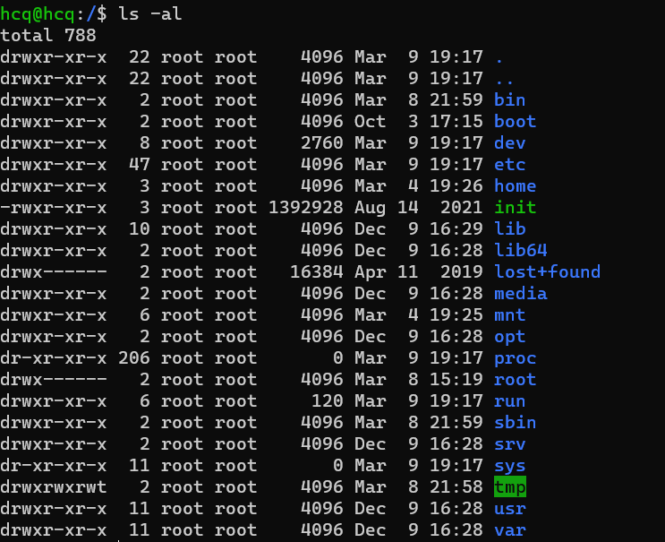

# Linux基础

## 一、基础知识

Linux是个多用户多任务的系统。

使用文件拥有者、群组、其他人等概念实现多用户控制。每个文件都有User、Group、Others三种身份识别属性。

### 文件属性

`ls`命令用于显示指定工作目录下之内容（列出目前工作目录所含之文件及子目录)。

* -a 显示所有文件及目录 (**.** 开头的隐藏文件也会列出)
* -l 除文件名称外，亦将文件型态、权限、拥有者、文件大小等资讯详细列出
* -r 将文件以相反次序显示(原定依英文字母次序)
* -t 将文件依建立时间之先后次序列出
* -A 同 -a ，但不列出 "." (目前目录) 及 ".." (父目录)
* -F 在列出的文件名称后加一符号；例如可执行档则加 "*", 目录则加 "/"
* -R 若目录下有文件，则以下之文件亦皆依序列出

使用`ls -al` 命令查看目录下文件

七列分别代表[][][权限] [链接] [拥有者] [群组] [文件大小] [修改日期] [文件名]

[权限] 项有是个字符，第一个字符代表文件类型，

* 当为[ d ]则是目录
* 当为[ - ]则是文件
* 若是[ l ]则表示为链接文件（link file）
* 若是[ b ]则表示为设备文件里面的可供储存的周边设备（可随机存取设备）
* 若是[ c ]则表示为设备文件里面的序列埠设备，例如键盘、鼠标（一次性读取设备）

接下来的字符以三个为一组，均为“rwx”的组合，其中'r'代表可读，'w'代表可写，'x'代表可执行，三个符号的位置不会改变，如果没有权限，则用 '-' 代替。三组权限中，第一组为文件拥有者（User）具备的权限，第二组为群组（Group）中的账号拥有的权限，第三组为其他人（Others）所具有的权限。

[链接] 表示有多少文件名链接到此节点。

### 改变文件属性与权限

常用的更改文件属性的命令有以下几个;

* chgrp ：改变文件所属群组

`chgrp groupname filename`

* chown ：改变文件拥有者

`chown [-R] username filename`

* chmod ：改变文件的权限, SUID, SGID, SBIT等等的特性

 

## 二、常用命令

#### 1.apt-get和apt的区别

Debian 作为 Ubuntu、Linux Mint 和 elementary OS 等 Linux 操作系统的母板，其具有强健的「包管理」系统，它的每个组件和应用程序都内置在系统中安装的软件包中。Debian 使用一套名为 [Advanced Packaging Tool](https://wiki.debian.org/Apt)（APT）的工具来管理这种包系统。

apt-get 是其中一款广受欢迎的命令行工具。最常用的 Linux 包管理命令都被分散在了 apt-get、apt-cache 和 apt-config 这三条命令当中。

apt 命令的引入就是为了解决命令过于分散的问题，它包括了 apt-get 命令出现以来使用最广泛的功能选项，以及 apt-cache 和 apt-config 命令中很少用到的功能。

> 简单来说就是：apt = apt-get、apt-cache 和 apt-config 中最常用命令选项的集合。

